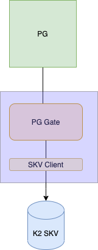
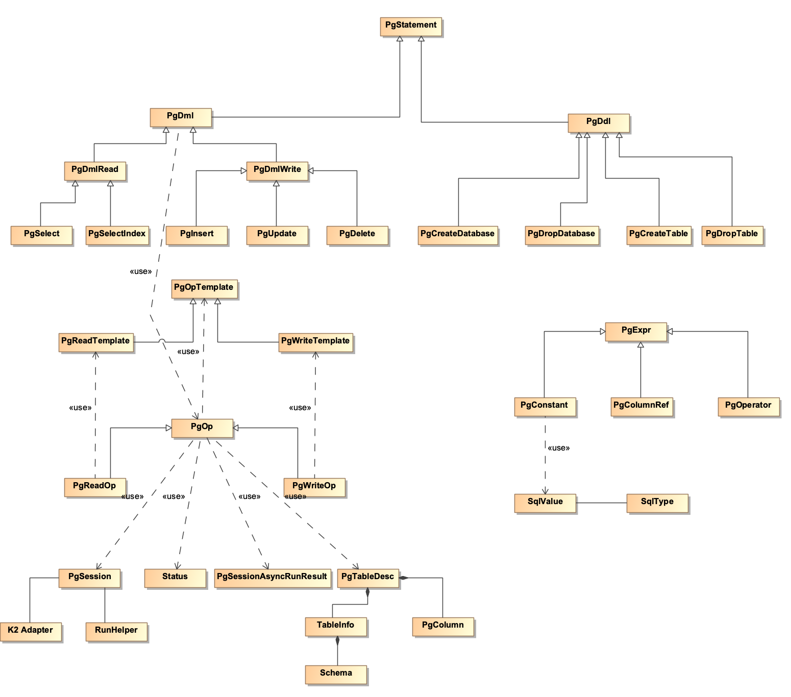
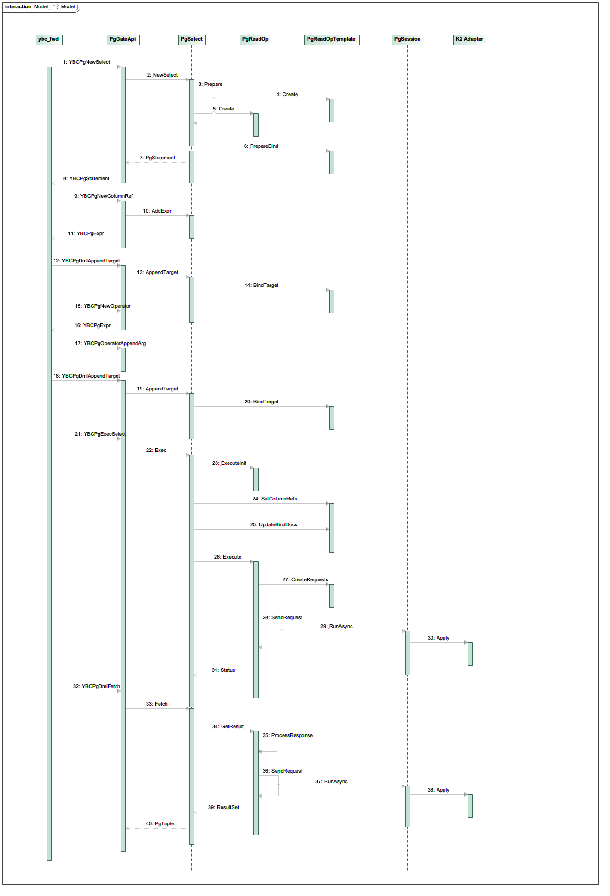

This document is to explain how Pg gate is implemented to provide integration between Postgres and K2 SKV. It is a working in progress.

# Introduction

PG gate is a component of the SQL layer for K2 Chogori SQL, which is based on Postgres running on top of K2 SKV, a schema aware in-memory key value store.
The design draft is proposed [here] (./K2SqlDesignProposal). Here the PG gate is a component that integrates Postgres and K2 SKV. Please be aware that we 
adopted the modified version of PG from YugabyteDB and thus, we also inherit most of its logic implemented inside PG. Here we only cover the PG gate 
implementation from PG to SKV client. The SKV client itself is outside of the scope of this document.



## Interface between PG and PG Gate 

To better understand the PG gate implementation, we need to understand some context since our implementation is not built from scratch, but 
is adopted the modified version of PG from YugabyteDB. We inherited almost all the logic whatever Yugabytedb have modified inside PG.

### PG Gate APIs 

PG calls the PG Gate via a set of APIs that are defined in [pg_gate_api.h](../src/k2/connector/yb/pggate/pg_gate_api.h). The APIs are exposed as C methods to 
PG, but PG Gate is implemented in C++. The following C files inside PG calls these APIs for different operations.
* [ybcbootstrap.c](../src/k2/postgres/src/backend/commands/ybcbootstrap.c): commands for creating and altering table structures and settings during bootstrap phase.
* [ybccmds.c](../src/k2/postgres/src/backend/commands/ybccmds.c): commands for creating and altering table structures and settings during regular runtime.
* [ybcam.c](../src/k2/postgres/src/backend/executor/ybcam.c): used to access data from YugaByte's system catalog tables.
* [ybc_fdw.c](../src/k2/postgres/src/backend/executor/ybc_fdw.c): Foreign-data wrapper to scan data from external data storage 
* [ybcModifyTable.c](../src/k2/postgres/src/backend/executor/ybcModifyTable.c): routines to stmt_handle ModifyTable nodes, i.e., Insert, Delete, and Update tables.

### Shared Data Structures 

The above PG gate APIs defined a set of data structures that are used to exchange data and status between PG and PG gate c++ implementation. These data structures
are defined in [pg_gate_typedefs.h](../src/k2/connector/yb/pggate/pg_gate_typedefs.h). But the following data structures are mapped from PG to PG gate via 
c/C++ template typedef. 
* [YBCPgExpr](../src/k2/postgres/src/backend/executor/ybcExpr.c) -> [PgExpr](../src/k2/connector/yb/entities/expr.h): column reference and conditions in where clause. 
They are three types of YBCPgEnv, i.e., PgConstant representing a value, PgColumnRef, and PgOperator for aggregations and other logic conditions such as in, between, equal and so on.
* YBCPgStatement -> [PgStatement](../src/k2/connector/yb/pggate/pg_statement.h): a handle for SQL statement. The DMLs are extends from this base class on PG gate side, 
for example, PGSelect, PGSelectIndex, PGInsert. PGDelete, and PgUpdate. For DDLs, a set of classes are defined based on the DDL operation such as PgCreateDatabase and 
PgCreateTable. 
* YBCPgTableDesc -> [PgTableDesc](../src/k2/connector/yb/pggate/pg_tabledesc.h): table information including [table schema](../src/k2/connector/yb/entities/table.h) and column index mapping.
* YBCPgEnv -> [PgEnv](../src/k2/connector/yb/pggate/pg_env.h): Part of PG environment variables that are useful for ENV custom values.
* YBCPgMemCtx -> [PgMemctx](../src/k2/connector/yb/pggate/pg_memctx.h): the PG gate counterpart of PG's MemoryContext and it holds PgStatements and PgTableDesc.

Apart from the above, YBCStatus is mapped to the C [Status](../src/k2/connector/yb/common/status.h) and a [PgSession](../src/k2/connector/yb/pggate/pg_session.h)
is implicitly used by the PG gate APIs. 

### Statement Lifecycle
A major portion of the PG gate APIs are for SQL statements, for example, select, insert, update, and delete. For a statement, i.e., PgStatement, it consists of
the following life cycle:
* Prepare statement: 
** Initialize: create the data structures for the statement, for example, base request.
** Bind columns: bind the conditions in the where clause as a list of PgExpr.
** Append targets: set the columns that the statement needs to return as a list of PgExpr.
** Assign columns: used in update statement for the Set clause.
* Execute statement: run the statement, which could be run in a batch fashion by the document client logic (Not implemented yet). 
* Fetch result: get statement result, for example, the YBCPgDmlFetch() is called by the Select statement.

## PG Internal 

Pg Gate class diagram is illustrated in the following diagram. We cover the main classes in the next subsections.



### Statement 

Statement type and its base class are defined in [pg_statement.h](../src/k2/connector/yb/pggate/pg_statement.h).

``` c
enum StmtOp {
  STMT_NOOP = 0,
  STMT_CREATE_DATABASE,
  STMT_DROP_DATABASE,
  STMT_CREATE_SCHEMA,
  STMT_DROP_SCHEMA,
  STMT_CREATE_TABLE,
  STMT_DROP_TABLE,
  STMT_TRUNCATE_TABLE,
  STMT_CREATE_INDEX,
  STMT_DROP_INDEX,
  STMT_ALTER_TABLE,
  STMT_INSERT,
  STMT_UPDATE,
  STMT_DELETE,
  STMT_TRUNCATE,
  STMT_SELECT,
  STMT_ALTER_DATABASE,
};
```
The base class PgStatement is extended as PgDml for DMLs 

``` c
class PgDml : public PgStatement {
 PgDml(PgSession::ScopedRefPtr pg_session,
        const PgObjectId& table_id,
        const PgObjectId& index_id,
        const PgPrepareParameters *prepare_params);
 PgObjectId table_id_;
 PgObjectId index_id_;
 PgTableDesc::ScopedRefPtr target_desc_;
 std::vector<PgExpr*> targets_;
 PgTableDesc::ScopedRefPtr bind_desc_;  
 PgPrepareParameters prepare_params_;
 std::unordered_map<SqlOpExpr*, PgExpr*> expr_binds_;
 std::unordered_map<SqlOpExpr*, PgExpr*> expr_assigns_;
 std::list<PgOpResult> rowsets_; 
 int64_t current_row_order_ = 0;

 // DML Operator.
 PgOp::SharedPtr doc_op_;
 scoped_refptr<PgSelectIndex> secondary_index_query_; 
}; 
```

and PgDdl for DDLs.

``` c
class PgDdl : public PgStatement {
 public:
  explicit PgDdl(PgSession::ScopedRefPtr pg_session) : PgStatement(pg_session) {
  }

  virtual CHECKED_STATUS ClearBinds() {
    return STATUS(InvalidArgument, "This statement cannot be bound to any values");
  }
};

```
PgDml is extended by PgDmlRead and PgDmlWrite, the former is further extened by [PgSelect and PgSelectIndex](../src/k2/connector/yb/pggate/pg_select.h). 
The latter is extended by [PgUpdate](../src/k2/connector/yb/pggate/pg_update.h), [PgInsert](../src/k2/connector/yb/pggate/pg_insert.h), 
and [PgDelete](../src/k2/connector/yb/pggate/pg_delete.h). 

### Operations 

A Sql statement could consists of one or a set of operations, for example, a select statement could consists of multiple read operations for pagination 
or different read operations for different data partitions. To avoid creating the same requests from scratch repeatedly, PG gate first implements a 
template operation for read and write so that the requests could be cloned and updated. The template operation is very simply and mainly consists of 
request and response that will be interacted with SKV client in K2 Adapter as defined by the following base class [pg_op_api.h](../src/k2/connector/yb/pggate/pg_op_api.h).

``` c
class PgOpTemplate {
    public: 
    enum Type {
        WRITE = 8,
        READ = 9,
    };

    explicit PgOpTemplate(const std::shared_ptr<TableInfo>& table);

    protected:
    std::shared_ptr<TableInfo> table_;
    std::unique_ptr<SqlOpResponse> response_;
    std::string rows_data_;
    bool is_active_ = true;
};       
```
PgWriteOpTemplate and PgReadOpTemplate are read and write template operation, respectively. 

``` c
class PgReadOpTemplate : public PgOpTemplate {
    public:
    explicit PgReadOpTemplate(const std::shared_ptr<TableInfo>& table);
    ...
    private:
    std::unique_ptr<SqlOpReadRequest> read_request_;
};

class PgWriteOpTemplate : public PgOpTemplate {
    public:
    explicit PgWriteOpTemplate(const std::shared_ptr<TableInfo>& table);
    ...
    private: 
    td::unique_ptr<SqlOpWriteRequest> write_request_;
    // Whether this operation should be run as a single row txn.
    // Else could be distributed transaction (or non-transactional) depending on target table type.
    bool is_single_row_txn_ = false;
};    
```

As explained above, the above templates are wrapper classes to hold request, response, and other information when we send the 
operation to the storage layer. The actual operation concept that works with Statement and PG APIs are defined in [pg_op.h](../src/k2/connector/yb/pggate/pg_op.h),
which includes logic for session, sending request, and processing response as shown in the following base class.

``` c
class PgOp : public std::enable_shared_from_this<PgOp> {
    public:
    explicit PgOp(const PgSession::ScopedRefPtr& pg_session,
                 const PgTableDesc::ScopedRefPtr& table_desc,
                 const PgObjectId& relation_id = PgObjectId());  

    // Initialize doc operator.
    virtual void ExecuteInit(const PgExecParameters *exec_params);

    // Execute the op. Return true if the request has been sent and is awaiting the result.
    virtual Result<RequestSent> Execute(bool force_non_bufferable = false);

    // Instruct this doc_op to abandon execution and querying data by setting end_of_data_ to 'true'.
    // - This op will not send request to storage layer.
    // - This op will return empty result-set when being requested for data.
    void AbandonExecution();

    // Get the result of the op. No rows will be added to rowsets in case end of data reached.
    CHECKED_STATUS GetResult(std::list<PgOpResult> *rowsets);
    Result<int32_t> GetRowsAffectedCount() const;
    ...

    protected:
    // Session control.
    PgSession::ScopedRefPtr pg_session_;
                 
    // Operation time. This time is set at the start and must stay the same for the lifetime of the
    // operation to ensure that it is operating on one snapshot.
    uint64_t read_time_ = 0;

    // Target table.
    PgTableDesc::ScopedRefPtr table_desc_;
    PgObjectId relation_id_; 

    // Exec control parameters.
    PgExecParameters exec_params_; 

    // Populated operation request.
    std::vector<std::shared_ptr<PgOpTemplate>> pgsql_ops_;

    // Future object to fetch a response from storage after sending a request.
    // Object's valid() method returns false in case no request is sent
    // or sent request was buffered by the session.
    // Only one RunAsync() can be called to sent storage at a time.
    PgSessionAsyncRunResult response_;  
    
    // Executed row count.
    int32_t rows_affected_count_ = 0;
    ...  
};           
```

Accordingly, we also defined PgReadOp and PgWriteOp for read and write operation, respectively. 

``` c
class PgReadOp : public PgOp {
  ...
  // Template operation, used to fill in pgsql_ops_ by either assigning or cloning.
  td::shared_ptr<PgReadOpTemplate> template_op_;  
};  

class PgWriteOp : public PgOp {
    // Template operation all write ops.
    std::shared_ptr<PgWriteOpTemplate> write_op_;
    uint64_t write_time_ = 0;
};
```
### Session 

A session is associated with one client connection with PG and it is created when PG calls the following API:

``` c
YBCStatus YBCPgInitSession(const YBCPgEnv pg_env, const char *database_name);
```
The [PgSession](../src/k2/connector/yb/pggate/pg_session.h) is the core class of the PG gate and it links PgStatement, Operations, cache, 
and async runner together. 
* the current connected database name 
* table schema cache by table id 
* foreign key reference cache 
* Operation buffer for transactional ones and non-transactional ones
* Run helper to buffer and flush operations in an asynchronous fashion 
* K2 adapter reference 

``` c
class PgSession : public RefCountedThreadSafe<PgSession> {
  PgSession(K2Adapter* k2_adapter,
            const string& database_name,
            const YBCPgCallbacks& pg_callbacks);
...
  template<class Op>
  Result<PgSessionAsyncRunResult> RunAsync(const std::shared_ptr<Op>* op,
                                           size_t ops_count,
                                           const PgObjectId& relation_id,
                                           uint64_t* read_time,
                                           bool force_non_bufferable) {
    DCHECK_GT(ops_count, 0);
    RunHelper runner(this, k2_adapter_, ShouldHandleTransactionally(**op));
    for (auto end = op + ops_count; op != end; ++op) {
      RETURN_NOT_OK(runner.Apply(*op, relation_id, read_time, force_non_bufferable));
    }
    return runner.Flush();
  }

  CHECKED_STATUS HandleResponse(const PgOpTemplate& op, const PgObjectId& relation_id);

  private:
  CHECKED_STATUS FlushBufferedOperationsImpl();

  CHECKED_STATUS FlushBufferedOperationsImpl(const PgsqlOpBuffer& ops, bool transactional);
 // Flush buffered write operations from the given buffer.
  Status FlushBufferedWriteOperations(PgsqlOpBuffer* write_ops, bool transactional);

  // Whether we should use transactional or non-transactional session.
  bool ShouldHandleTransactionally(const PgOpTemplate& op);

  // Connected database.
  std::string connected_database_;

  // Execution status.
  Status status_;
  string errmsg_;

    // Rowid generator.
  ObjectIdGenerator rowid_generator_;

  K2Adapter* const k2_adapter_;

  std::unordered_map<TableId, std::shared_ptr<TableInfo>> table_cache_;
  std::unordered_set<PgForeignKeyReference, boost::hash<PgForeignKeyReference>> fk_reference_cache_;

  // Should write operations be buffered?
  bool buffering_enabled_ = false;
  PgsqlOpBuffer buffered_ops_;
  PgsqlOpBuffer buffered_txn_ops_;
  std::unordered_set<RowIdentifier, boost::hash<RowIdentifier>> buffered_keys_;

  const YBCPgCallbacks& pg_callbacks_;

  MonoDelta timeout_;
};            
```

### Transaction 

For PG gate transaction apis, we simply delete them to SKV client via K2 Adapter in [pg_txn_handler](../src/k2/connector/yb/pggate/pg_txn_handler.h).

``` c
class PgTxnHandler : public RefCountedThreadSafe<PgTxnHandler> {
  public:
  PgTxnHandler(K2Adapter *adapter);

  CHECKED_STATUS BeginTransaction();

  CHECKED_STATUS RestartTransaction();

  CHECKED_STATUS CommitTransaction();

  CHECKED_STATUS AbortTransaction();

  CHECKED_STATUS SetIsolationLevel(int isolation);

  CHECKED_STATUS SetReadOnly(bool read_only);

  CHECKED_STATUS SetDeferrable(bool deferrable);

  CHECKED_STATUS EnterSeparateDdlTxnMode();

  CHECKED_STATUS ExitSeparateDdlTxnMode(bool success);  

  private:  
  std::shared_ptr<K23SITxn> txn_;

  bool txn_in_progress_ = false;

  // Postgres transaction characteristics.
  PgIsolationLevel isolation_level_ = PgIsolationLevel::REPEATABLE_READ;

  bool read_only_ = false;

  bool deferrable_ = false;

  std::atomic<bool> can_restart_{true};

  K2Adapter* adapter_;
};         
```
where the PG isolation level is defined as follows.

``` c
// These should match XACT_READ_UNCOMMITED, XACT_READ_COMMITED, XACT_REPEATABLE_READ,
// XACT_SERIALIZABLE from xact.h.
enum class PgIsolationLevel {
  READ_UNCOMMITED = 0,
  READ_COMMITED = 1,
  REPEATABLE_READ = 2,
  SERIALIZABLE = 3,
};
```
### K2 Adapter 

The PgOpTemplate in [pg_op_api.h](../src/k2/connector/yb/pggate/pg_op_api.h) defines the request and response that PG gate expects from SKV. 
Its [K2 adapter's](../src/k2/connector/yb/pggate/k2_adapter.h) responsibility to convert the request to SKV client request and then convert the response back from SKV client response. Please
be aware that the k2 adapter handle the requests in an asynchronous fashion and it could handle a batch of operations one by one when PgSession 
flushes buffered operations.

``` c
class K2Adapter {
  ...  
  CHECKED_STATUS Init();

  CHECKED_STATUS Shutdown();

  CHECKED_STATUS Apply(std::shared_ptr<PgOpTemplate> op);

  void FlushAsync(StatusFunctor callback);

  std::future<yb::Status> FlushFuture() {
    return MakeFuture<yb::Status>([this](auto callback) { this->FlushAsync(std::move(callback)); });
  }

  std::string getDocKey(SqlOpReadRequest& request);
        
  std::string getDocKey(SqlOpWriteRequest& request);

  // TODO: pass transaction option
  std::shared_ptr<K23SITxn> beginTransaction();
};
```

## Interface to SKV 

K2 adapter described in the above section interacts with SKV client, as a result, it needs to convert SqlOpReadRequest and SqlOpWriteRequest
defined in [pg_op_api.h](../src/k2/connector/yb/pggate/pg_op_api.h) to SKV client API and convert the response from SKV client back to SqlOpResponse.

SqlOpReadRequest is defined as follows.

``` c
    struct SqlOpReadRequest {
        SqlOpReadRequest() = default;

        string client_id;
        int64_t stmt_id;
        NamespaceName namespace_name;
        TableName table_name;
        uint64_t schema_version;
        uint32_t hash_code;
        std::vector<SqlOpExpr*> partition_column_values;
        std::vector<SqlOpExpr*> range_column_values;
        SqlOpExpr* ybctid_column_value;
        // For select using local secondary index: this request selects the ybbasectids to fetch the rows
        // in place of the primary key above.
        SqlOpReadRequest* index_request;

        RSRowDesc rsrow_desc;
        std::vector<SqlOpExpr*> targets;
        SqlOpExpr* where_expr;
        SqlOpCondition* condition_expr;
        SqlOpColumnRefs* column_refs;
        bool is_forward_scan = true;
        bool distinct = false;
        bool is_aggregate = false;
        uint64_t limit;
        SqlOpPagingState* paging_state;
        bool return_paging_state = false;
        uint32_t max_hash_code;
        uint64_t catalog_version;
        RowMarkType row_mark_type;
        string* max_partition_key;

        std::unique_ptr<SqlOpReadRequest> clone();
    };
```

and SqlOpWriteRequest

``` c
    struct SqlOpWriteRequest {
       SqlOpWriteRequest() = default;

       enum StmtType {
            PGSQL_INSERT = 1,
            PGSQL_UPDATE = 2,
            PGSQL_DELETE = 3,
            PGSQL_UPSERT = 4,
            // TODO: not used in K2, remove it
            PGSQL_TRUNCATE_COLOCATED = 5
        };
        
        string client_id;
        int64_t stmt_id;
        StmtType stmt_type;
        NamespaceId namespace_name;
        TableName table_name;
        uint64_t schema_version;
        uint32_t hash_code;
        std::vector<SqlOpExpr*> partition_column_values;
        std::vector<SqlOpExpr*> range_column_values;
        SqlOpExpr* ybctid_column_value;
        // Not used with UPDATEs. Use column_new_values to UPDATE a value.
        std::vector<ColumnValue> column_values;
        // Column New Values.
        // - Columns to be overwritten (UPDATE SET clause). This field can contain primary-key columns.
        std::vector<ColumnValue> column_new_values;
        RSRowDesc rsrow_desc;
        std::vector<SqlOpExpr*> targets;
        SqlOpExpr* where_expr;
        SqlOpCondition* condition_expr;
        SqlOpColumnRefs* column_refs;
        uint64_t catalog_version;
        // True only if this changes a system catalog table (or index).
        bool is_ysql_catalog_change;

        std::unique_ptr<SqlOpWriteRequest> clone();
    };
```
where SqlOpExpr could be a value, column reference, a condition, or a nested SqlOpExpr.

The response that PG gate expects from K2 adapter is defined in SqlOpResponse.

``` c
    // Response from K2 storage for both read and write.
    struct SqlOpResponse {
          enum class RequestStatus {
            PGSQL_STATUS_OK = 0,
            PGSQL_STATUS_SCHEMA_VERSION_MISMATCH = 1,
            PGSQL_STATUS_RUNTIME_ERROR = 2,
            PGSQL_STATUS_USAGE_ERROR = 3,
            PGSQL_STATUS_RESTART_REQUIRED_ERROR = 4,
            PGSQL_STATUS_DUPLICATE_KEY_ERROR = 5
        };
        RequestStatus status = RequestStatus::PGSQL_STATUS_OK;
        bool skipped;
        string error_message;
        int32_t rows_data_sidecar;
        SqlOpPagingState* paging_state;
        int32_t rows_affected_count;
   
        //
        // External statuses.
        //
        // If you add more of those, make sure they are correctly picked up, e.g.
        // by PgPgReadOpTemplate::ReceiveResponse and PgPgOpTemplate::HandleResponseStatus
        //

        // PostgreSQL error code encoded as in errcodes.h or yb_pg_errcodes.h.
        // See https://www.postgresql.org/docs/11/errcodes-appendix.html
        uint64_t pg_error_code;

        // Transaction error code, obtained by static_cast of TransactionErrorTag::Decode
        // of Status::ErrorData(TransactionErrorTag::kCategory)
        int32_t txn_error_code;      
    };
```

However, the actual data is stored in the rows_data_ variable in PgOpTemplate and the rows_data_ is automatically processed 
by PgOp as PgOpResult for PG to consume.

# Examples 

We are going to use the following to examples to demonstrate how the pg logic works.

## Foreign Data Wrapper

Here we take the select statement in foreign data wrapper as an example to show the logic flow among Pg and Pg Gate. First, the YbFdwExecState structure in [ybc_fdw.c](../src/k2/postgres/src/backend/executor/ybc_fdw.c) consists of a Sql statement handle, the owner, and the runtime parameters exec_params.

``` c
typedef struct YbFdwExecState
{
	/* The handle for the internal YB Select statement. */
	YBCPgStatement	handle;
	ResourceOwner	stmt_owner;
	YBCPgExecParameters *exec_params; /* execution control parameters for YugaByte */
	bool is_exec_done; /* Each statement should be executed exactly one time */
} YbFdwExecState;
```

[ybc_fdw.c](../src/k2/postgres/src/backend/executor/ybc_fdw.c) is the foreign data wrapper to scan data from external data source. It first calls ybcBeginForeignScan()
to allocate a Select handler. (only related logic is shown for the sake of clarity).

``` c
static void
ybcBeginForeignScan(ForeignScanState *node, int eflags)
{
	/* Allocate and initialize YB scan state. */
	ybc_state = (YbFdwExecState *) palloc0(sizeof(YbFdwExecState));

	node->fdw_state = (void *) ybc_state;
	HandleYBStatus(YBCPgNewSelect(YBCGetDatabaseOid(relation),
				   RelationGetRelid(relation),
				   NULL /* prepare_params */,
				   &ybc_state->handle));  
  ...
 	ybc_state->is_exec_done = false;
   
	/* Set the current syscatalog version (will check that we are up to date) */
	HandleYBStatusWithOwner(YBCPgSetCatalogCacheVersion(ybc_state->handle,
														yb_catalog_cache_version),
														ybc_state->handle,
														ybc_state->stmt_owner);
}                                     
```

Then it calls ybcSetupScanTargets() to setup the scan targets either column references or aggregates.

``` c
static void
ybcSetupScanTargets(ForeignScanState *node)
{
	/* Set scan targets. */
	if (node->yb_fdw_aggs == NIL)
	{
		/* Set non-aggregate column targets. */
		bool has_targets = false;
		foreach(lc, target_attrs)
		{
      ...
			YBCPgTypeAttrs type_attrs = {attr_typmod};
			YBCPgExpr      expr       = YBCNewColumnRef(ybc_state->handle,
														target->resno,
														attr_typid,
														&type_attrs);
			HandleYBStatusWithOwner(YBCPgDmlAppendTarget(ybc_state->handle,
																									 expr),
															ybc_state->handle,
															ybc_state->stmt_owner);
			has_targets = true;
		}
  ...
 		/* Set aggregate scan targets. */
		foreach(lc, node->yb_fdw_aggs)
		{
 			YBCPgExpr op_handle;
			const YBCPgTypeEntity *type_entity;

			/* Get type entity for the operator from the aggref. */
			type_entity = YBCPgFindTypeEntity(aggref->aggtranstype);

			/* Create operator. */
			HandleYBStatusWithOwner(YBCPgNewOperator(ybc_state->handle,
													 func_name,
													 type_entity,
													 &op_handle),
									ybc_state->handle,
									ybc_state->stmt_owner);

			/* Handle arguments. */
			if (aggref->aggstar) {
				/*
				 * Add dummy argument for COUNT(*) case, turning it into COUNT(0).
				 * We don't use a column reference as we want to count rows
				 * even if all column values are NULL.
				 */
				YBCPgExpr const_handle;
				YBCPgNewConstant(ybc_state->handle,
								 type_entity,
								 0 /* datum */,
								 false /* is_null */,
								 &const_handle);
				HandleYBStatusWithOwner(YBCPgOperatorAppendArg(op_handle, const_handle),
										ybc_state->handle,
										ybc_state->stmt_owner);
...
}
```

After that, it calls ybcIterateForeignScan() to run the statement and fetch the results.

``` c
static TupleTableSlot *
ybcIterateForeignScan(ForeignScanState *node)
{
  ...
	if (!ybc_state->is_exec_done) {
		ybcSetupScanTargets(node);
		HandleYBStatusWithOwner(YBCPgExecSelect(ybc_state->handle, ybc_state->exec_params),
								ybc_state->handle,
								ybc_state->stmt_owner);
		ybc_state->is_exec_done = true;
	}
  ...
	/* Fetch one row. */
	HandleYBStatusWithOwner(YBCPgDmlFetch(ybc_state->handle,
	                                      tupdesc->natts,
	                                      (uint64_t *) values,
	                                      isnull,
	                                      &syscols,
	                                      &has_data),
	                        ybc_state->handle,
	                        ybc_state->stmt_owner);
  ...                            
}
```

The following sequence diagram illustrates the logic in Pg gate.



## System catalog scan

[ybcam.c](../src/k2/postgres/src/backend/executor/ybcam.c) includes the logic to scan the system catalog tables. Please check the source code for more details.


