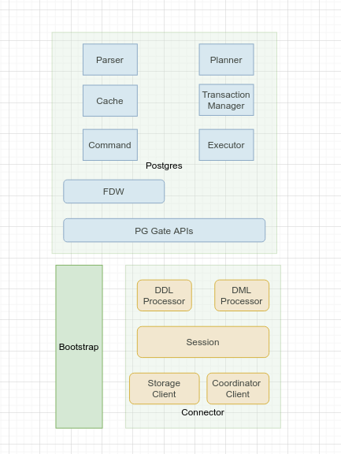
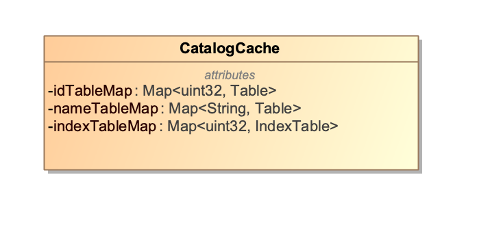
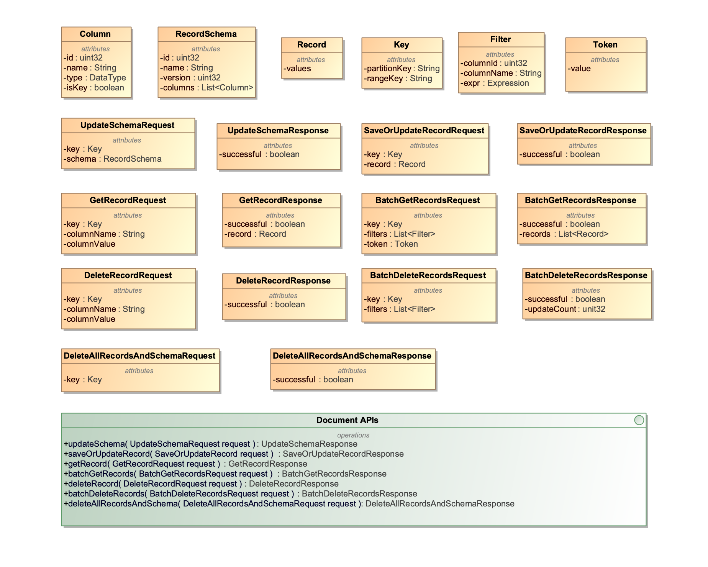
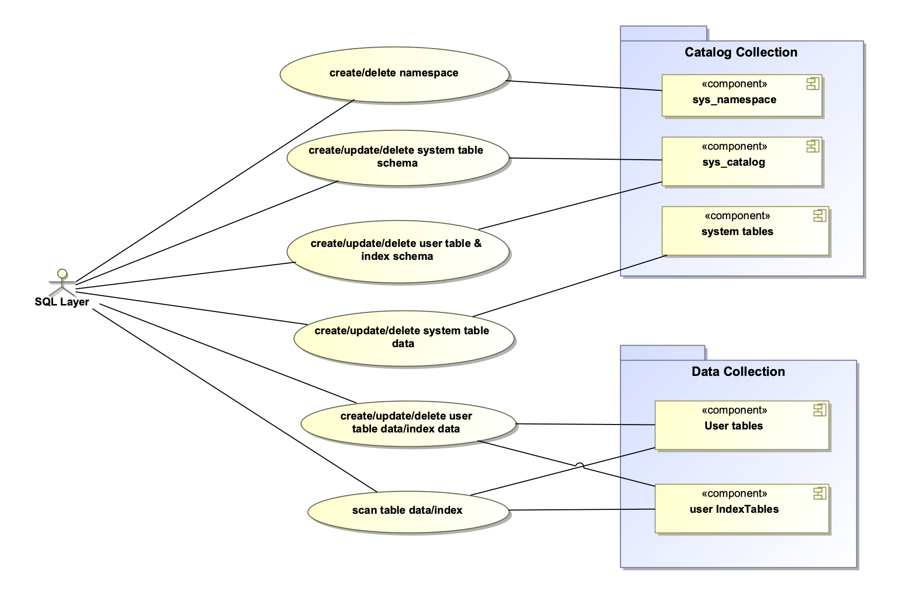

This document is a design proposal for the K2 SQL layer. It is a working in progress.

# Introduction
## Assumptions
K2 platform is an in-memory document storage system. We introduce a SQL layer on top of so that users could interactive with our system using SQLs.

The design is based on the following Assumptions:
* K2 Platform provides document APIs so that the SQL layers could access the table rows and columns with column projections and predicate pushdown
* For the first version of prototype, we will integrate Postgres (PG) database engine for query parsing, planning, and execution. That is to say, the query
execution is on a single PG instance, which might not be ideal for complex queries, but should work for most OLTP queries.
* However, we should make our design to be extensible to be able to run queries in a distributed fashion, i.e., a physical query plan could be split
into multiple segments to run on different nodes, which is useful for HTAP (Hybrid transaction/analytical processing) and OLAP in the future.
* Data persistency and consistency is guaranteed by the K2 storage layer
* Each table has a primary key and we need to specify one if it is not provided in schema definition.
* Primary keys that are used to partition tables cannot be changed once they are defined.

## Design Goals
We like to achieve the following goals for the first version of prototype.
* Support Catalog management by DDLs, i.e., create, update, and delete database and tables
* Support secondary indexes
* Support select with column projection and predication pushdown. Aggregation pushdown could be implemented in later versions.
* Support insert, update, delete, truncate, and simple joins
* Allow users to submit queries using PG libpq interface. JDBC and ODBC drivers could be provided in later versions.

# System Design Proposal

This is a high level design. Details will be provided in separate sections.

## Architecture

The system architecture is as follows and it consists of the following components.
* The storage layer provides document APIs so that we could storage data with data type information, table schemas, and secondary indexes into it.
* On the top of the storage layer, we have SQL executor, which could run separately on different hosts or the same host of the storage layer.
* There is a SQL coordinator so that it could manage catalog, index, and schema updates on k2 storage nodes.


### SQL Coordinator

The SQL coordinator has the following responsibilities
* Manage database and table schemas while user submits DDLs such as create, update, and delete tables.
* Manage secondary indexes for tables.
* Both table schema and indexes are stored as document in storage layer by calling K2 storage APIs.
* The catalog manager needs to handle schema update on the storage layer.
* Initialize PG system databases and system tables globally so that SQL executor could be stateless without creating its own local system databases/tables,
which are difficult to be consistent.
* Manage the table to collection/partition mapping in storage layer so that we could update the the document schema version and types
on K2 storage nodes when a user alters tables.
* Provide service APIs for the SQL executor to get table schema and index information
* Could provides a discovery service for a user to get an endpoint of a SQL executor to submit a query so that we can load balance the query load on
SQL executors. If we colocate a SQL executor with a K2 storage node, the coordinator could assign the query to the SQL executor where the data are stored
to achieve data locality
*  In the future, we could extend the coordinator, for example, it could generate SQL plan segments to dispatch to different SQL executors for parallel executions.
* For prototype, we could use a single instance coordinator. We could add a distributed coordinators by using raft consensus protocol later.

### SQL Executor
The SQL executor run SQL queries locally. For the first version, it is implemented by integrating with Postgres, i.e., it is a single instance
query executor.
* It is stateless, i.e., it won't create any local system databases or tables.
* User submits queries to it via the libpq client library and get back query results.
* It consists of an embedded PG with the following modifications
  * Foreign Data Wrapper is used to access table data on K2 storage layer instead of from local memory and disk, this is mainly for table scan
with expressions for column projection and predicate pushdown.
  * SQL grammar is updated to only support a subset of Queries. Will add more query types incrementally.
  * PG command APIs are updated to call catalog manager instead of local catalogs
  * Index update and scan are rerouted to K2 storage layer
  * The above functions are implemented by calling a connector as a glue layer between PG and K2 storage layer
  * The executor in PG manages the life cycle of a query, i.e., parsing, planning, optimizing, and executing.
*  The connector layer is used by PG to interact with SQL coordinator and K2 storage layer
    * PG calls its PG gate APIs for DDLs and DMLs
    * It calls catalog manager in SQL coordinator for user databases and tables
    * It calls Index manager in SQL coordinator for secondary indexes
    * It scans table data from K2 storage layer with column projection and predication pushdown. Streaming or pagination is used to fetch result data.
    * It scans table indexes for an index scan.
    * It could call multiple K2 storage nodes if the SQL involves multiple tables on different K2 collections/partitions

### K2 Storage Layer
K2 storage layer functions consist of
* Table data are stored in K2 storage layer. The collection holds schema information.
* PG system tables, user tables, and table secondary indexes are stored as regular data in k2 storage layer.
* It provides document style APIs for the connector in SQL executor to access table data or secondary index
* SQL executor might call the transaction protocol in K2 storage layer for a SQL transaction with multiple collection/partition updates
* The collection schemas for a partition need to be updated by SQL coordinator with a different schema version id.

## SQL Layer

The SQL layer consists of the SQL executors and the SQL coordinator(s). Let us cover them in more details.

### SQL Executor

A more detailed view of SQL executor is shown by the following diagram.



First of all, the SQL executor uses a bootstrap module to initialize the process Environment, for example, waiting for the coordinator
to create system databases and tables. Then it starts a PG instance either as a child process or embedded inside. Optionally it
starts a RPC server to accept Query execution commands from coordinator if we starts to support distributed query executions. The Libpq interface is provided by the PG process.

#### Postgres

We could adopt the modified version of PG from [YugaByteDB](https://github.com/futurewei-cloud/chogori-sql/blob/master/docs/YugabyteDb.md), which has the following customization
* Modified the initdb.c to not create system databases and tables locally and relies on remote catalog manager instead.
* Wired in a Foreign Data Wrapper (DFW) to scan data from an external data source instead of local memory and disk.
* Changed PG commands to call external catalog manager
* Changed Index Scan to read from external data source.
* Updated caching logic for external data sources
* Implemented sequence support
* Implemented column projection and predicate pushdown to external data sources
* Implemented aggression pushdown for min, max, sum, and count
* Used the [PG Gate APIs](https://github.com/futurewei-cloud/chogori-sql/blob/master/src/k2/postgres/src/include/yb/pggate/ybc_pggate.h) to interact
with external catalog manager and data sources.
However, we need to change PG for our own use, which means we might need to change the PG Gate APIs as well.
* Update the SQL grammar [gram.y](https://github.com/futurewei-cloud/chogori-sql/blob/master/src/k2/postgres/src/backend/parser/gram.y) to only enable
the SQL syntax that we support
* Remove/disable the colocated table logic
* Changed the tablet logic, which was part of YugaByteDB's storage component
* Disable aggression push down for now until we support them in K2 storage layer
* Update the transaction logic to integrate with K2S3 transaction protocol
* Need to check if we could support sequence

#### PG Gate APIs

The PG Gate APIs include the following parts. We would customize them to our need.

##### Environment and Session
The PG needs to call the K2 connector to setup runtime environment and SQL sessions.

``` c
void YBCInitPgGate(const YBCPgTypeEntity *YBCDataTypeTable, int count, YBCPgCallbacks pg_callbacks);
void YBCDestroyPgGate();

// Initialize ENV within which PGSQL calls will be executed.
YBCStatus YBCPgCreateEnv(YBCPgEnv *pg_env);
YBCStatus YBCPgDestroyEnv(YBCPgEnv pg_env);

// Initialize a session to process statements that come from the same client connection.
YBCStatus YBCPgInitSession(const YBCPgEnv pg_env, const char *database_name);

// Initialize memory context to hold all of its allocated space. Once all associated operations
//   are done, the context is destroyed.
YBCPgMemctx YBCPgCreateMemctx();
YBCStatus YBCPgDestroyMemctx(YBCPgMemctx memctx);
YBCStatus YBCPgResetMemctx(YBCPgMemctx memctx);

// Invalidate the sessions table cache.
YBCStatus YBCPgInvalidateCache();

// Clear all values and expressions that were bound to the given statement.
YBCStatus YBCPgClearBinds(YBCPgStatement handle);

// Check if initdb has been already run.
YBCStatus YBCPgIsInitDbDone(bool* initdb_done);
```
##### DDLs

Database operations

``` c
// Connect database. Switch the connected database to the given "database_name".
YBCStatus YBCPgConnectDatabase(const char *database_name);
// Create database.
YBCStatus YBCPgNewCreateDatabase(const char *database_name,
                                 YBCPgOid database_oid,
                                 YBCPgOid source_database_oid,
                                 YBCPgOid next_oid,
                                 const bool colocated,
                                 YBCPgStatement *handle);
YBCStatus YBCPgExecCreateDatabase(YBCPgStatement handle);

// Drop database.
YBCStatus YBCPgNewDropDatabase(const char *database_name,
                               YBCPgOid database_oid,
                               YBCPgStatement *handle);
YBCStatus YBCPgExecDropDatabase(YBCPgStatement handle);

// Alter database.
YBCStatus YBCPgNewAlterDatabase(const char *database_name,
                               YBCPgOid database_oid,
                               YBCPgStatement *handle);
YBCStatus YBCPgAlterDatabaseRenameDatabase(YBCPgStatement handle, const char *newname);
YBCStatus YBCPgExecAlterDatabase(YBCPgStatement handle);

// Reserve oids.
YBCStatus YBCPgReserveOids(YBCPgOid database_oid,
                           YBCPgOid next_oid,
                           uint32_t count,
                           YBCPgOid *begin_oid,
                           YBCPgOid *end_oid);
```

Table Operations
``` c
BCStatus YBCPgNewCreateTable(const char *database_name,
                              const char *schema_name,
                              const char *table_name,
                              YBCPgOid database_oid,
                              YBCPgOid table_oid,
                              bool is_shared_table,
                              bool if_not_exist,
                              bool add_primary_key,
                              const bool colocated,
                              YBCPgStatement *handle);

YBCStatus YBCPgCreateTableAddColumn(YBCPgStatement handle, const char *attr_name, int attr_num,
                                    const YBCPgTypeEntity *attr_type, bool is_hash, bool is_range,
                                    bool is_desc, bool is_nulls_first);
YBCStatus YBCPgExecCreateTable(YBCPgStatement handle);

YBCStatus YBCPgNewAlterTable(YBCPgOid database_oid,
                             YBCPgOid table_oid,
                             YBCPgStatement *handle);

YBCStatus YBCPgAlterTableAddColumn(YBCPgStatement handle, const char *name, int order,
                                   const YBCPgTypeEntity *attr_type, bool is_not_null);

YBCStatus YBCPgAlterTableRenameColumn(YBCPgStatement handle, const char *oldname,
                                      const char *newname);

YBCStatus YBCPgAlterTableDropColumn(YBCPgStatement handle, const char *name);

YBCStatus YBCPgAlterTableRenameTable(YBCPgStatement handle, const char *db_name,
                                     const char *newname);

YBCStatus YBCPgExecAlterTable(YBCPgStatement handle);

YBCStatus YBCPgNewDropTable(YBCPgOid database_oid,
                            YBCPgOid table_oid,
                            bool if_exist,
                            YBCPgStatement *handle);

YBCStatus YBCPgExecDropTable(YBCPgStatement handle);

YBCStatus YBCPgNewTruncateTable(YBCPgOid database_oid,
                                YBCPgOid table_oid,
                                YBCPgStatement *handle);

YBCStatus YBCPgExecTruncateTable(YBCPgStatement handle);

YBCStatus YBCPgGetTableDesc(YBCPgOid database_oid,
                            YBCPgOid table_oid,
                            YBCPgTableDesc *handle);

YBCStatus YBCPgGetColumnInfo(YBCPgTableDesc table_desc,
                             int16_t attr_number,
                             bool *is_primary,
                             bool *is_hash);

YBCStatus YBCPgGetTableProperties(YBCPgTableDesc table_desc,
                                  YBCPgTableProperties *properties);
```

Index operations
``` c
YBCStatus YBCPgNewCreateIndex(const char *database_name,
                              const char *schema_name,
                              const char *index_name,
                              YBCPgOid database_oid,
                              YBCPgOid index_oid,
                              YBCPgOid table_oid,
                              bool is_shared_index,
                              bool is_unique_index,
                              const bool skip_index_backfill,
                              bool if_not_exist,
                              YBCPgStatement *handle);

YBCStatus YBCPgCreateIndexAddColumn(YBCPgStatement handle, const char *attr_name, int attr_num,
                                    const YBCPgTypeEntity *attr_type, bool is_hash, bool is_range,
                                    bool is_desc, bool is_nulls_first);
BCStatus YBCPgExecCreateIndex(YBCPgStatement handle);

YBCStatus YBCPgNewDropIndex(YBCPgOid database_oid,
                            YBCPgOid index_oid,
                            bool if_exist,
                            YBCPgStatement *handle);

YBCStatus YBCPgExecDropIndex(YBCPgStatement handle);

YBCStatus YBCPgWaitUntilIndexPermissionsAtLeast(
    const YBCPgOid database_oid,
    const YBCPgOid table_oid,
    const YBCPgOid index_oid,
    const uint32_t target_index_permissions,
    uint32_t *actual_index_permissions);

YBCStatus YBCPgAsyncUpdateIndexPermissions(
    const YBCPgOid database_oid,
    const YBCPgOid indexed_table_oid);
```

The above DDLs are passed to the K2 connector, which calls the catalog manager in SQL coordinator under the hood.

##### DMLs

DML statements consist of select, insert, update, delete, and truncate.

First, we need to bind a SQL statement to columns and tables.

``` c
 // This function is for specifying the selected or returned expressions.
// - SELECT target_expr1, target_expr2, ...
// - INSERT / UPDATE / DELETE ... RETURNING target_expr1, target_expr2, ...
YBCStatus YBCPgDmlAppendTarget(YBCPgStatement handle, YBCPgExpr target);
YBCStatus YBCPgDmlBindColumn(YBCPgStatement handle, int attr_num, YBCPgExpr attr_value);
YBCStatus YBCPgDmlBindColumnCondEq(YBCPgStatement handle, int attr_num, YBCPgExpr attr_value);
YBCStatus YBCPgDmlBindColumnCondBetween(YBCPgStatement handle, int attr_num, YBCPgExpr attr_value,
    YBCPgExpr attr_value_end);
YBCStatus YBCPgDmlBindColumnCondIn(YBCPgStatement handle, int attr_num, int n_attr_values,
    YBCPgExpr *attr_values);

// Binding Tables: Bind the whole table in a statement.  Do not use with BindColumn.
YBCStatus YBCPgDmlBindTable(YBCPgStatement handle);

// API for SET clause.
YBCStatus YBCPgDmlAssignColumn(YBCPgStatement handle,
                               int attr_num,
                               YBCPgExpr attr_value);

// This function is to fetch the targets in YBCPgDmlAppendTarget() from the rows that were defined
// by YBCPgDmlBindColumn().
YBCStatus YBCPgDmlFetch(YBCPgStatement handle, int32_t natts, uint64_t *values, bool *isnulls,
                        YBCPgSysColumns *syscols, bool *has_data);

// Utility method that checks stmt type and calls either exec insert, update, or delete internally.
YBCStatus YBCPgDmlExecWriteOp(YBCPgStatement handle, int32_t *rows_affected_count);

// This function returns the tuple id (ybctid) of a Postgres tuple.
YBCStatus YBCPgDmlBuildYBTupleId(YBCPgStatement handle, const YBCPgAttrValueDescriptor *attrs,
                                 int32_t nattrs, uint64_t *ybctid);
```

Insert operations
``` c
BCStatus YBCPgNewInsert(YBCPgOid database_oid,
                         YBCPgOid table_oid,
                         bool is_single_row_txn,
                         YBCPgStatement *handle);

YBCStatus YBCPgExecInsert(YBCPgStatement handle);

YBCStatus YBCPgInsertStmtSetUpsertMode(YBCPgStatement handle);

YBCStatus YBCPgInsertStmtSetWriteTime(YBCPgStatement handle, const uint64_t write_time);
```

Update operations
``` c
YBCStatus YBCPgNewUpdate(YBCPgOid database_oid,
                         YBCPgOid table_oid,
                         bool is_single_row_txn,
                         YBCPgStatement *handle);

YBCStatus YBCPgExecUpdate(YBCPgStatement handle);
```

Delete operations
``` c
YBCStatus YBCPgNewDelete(YBCPgOid database_oid,
                         YBCPgOid table_oid,
                         bool is_single_row_txn,
                         YBCPgStatement *handle);

YBCStatus YBCPgExecDelete(YBCPgStatement handle);
```

Select operations
``` c
YBCStatus YBCPgNewSelect(YBCPgOid database_oid,
                         YBCPgOid table_oid,
                         const YBCPgPrepareParameters *prepare_params,
                         YBCPgStatement *handle);

// Set forward/backward scan direction.
YBCStatus YBCPgSetForwardScan(YBCPgStatement handle, bool is_forward_scan);

YBCStatus YBCPgExecSelect(YBCPgStatement handle, const YBCPgExecParameters *exec_params);
```

Expression operations
``` c
 / Column references.
YBCStatus YBCPgNewColumnRef(YBCPgStatement stmt, int attr_num, const YBCPgTypeEntity *type_entity,
                            const YBCPgTypeAttrs *type_attrs, YBCPgExpr *expr_handle);

// Constant expressions.
YBCStatus YBCPgNewConstant(YBCPgStatement stmt, const YBCPgTypeEntity *type_entity,
                           uint64_t datum, bool is_null, YBCPgExpr *expr_handle);
YBCStatus YBCPgNewConstantOp(YBCPgStatement stmt, const YBCPgTypeEntity *type_entity,
                           uint64_t datum, bool is_null, YBCPgExpr *expr_handle, bool is_gt);

// The following update functions only work for constants.
// Overwriting the constant expression with new value.
YBCStatus YBCPgUpdateConstInt2(YBCPgExpr expr, int16_t value, bool is_null);
YBCStatus YBCPgUpdateConstInt4(YBCPgExpr expr, int32_t value, bool is_null);
YBCStatus YBCPgUpdateConstInt8(YBCPgExpr expr, int64_t value, bool is_null);
YBCStatus YBCPgUpdateConstFloat4(YBCPgExpr expr, float value, bool is_null);
YBCStatus YBCPgUpdateConstFloat8(YBCPgExpr expr, double value, bool is_null);
YBCStatus YBCPgUpdateConstText(YBCPgExpr expr, const char *value, bool is_null);
YBCStatus YBCPgUpdateConstChar(YBCPgExpr expr, const char *value, int64_t bytes, bool is_null);

// Expressions with operators "=", "+", "between", "in", ...
YBCStatus YBCPgNewOperator(YBCPgStatement stmt, const char *opname,
                           const YBCPgTypeEntity *type_entity,
                           YBCPgExpr *op_handle);
YBCStatus YBCPgOperatorAppendArg(YBCPgExpr op_handle, YBCPgExpr arg);
```

Transaction operations
``` c
YBCStatus YBCPgBeginTransaction();
YBCStatus YBCPgRestartTransaction();
YBCStatus YBCPgCommitTransaction();
YBCStatus YBCPgAbortTransaction();
YBCStatus YBCPgSetTransactionIsolationLevel(int isolation);
YBCStatus YBCPgSetTransactionReadOnly(bool read_only);
YBCStatus YBCPgSetTransactionDeferrable(bool deferrable);
YBCStatus YBCPgEnterSeparateDdlTxnMode();
YBCStatus YBCPgExitSeparateDdlTxnMode(bool success);
```

The DMLs usually involve both the Catalog manager in SQL coordinator and direct access to K2 storage nodes.

#### K2 Connector

The K2 connector behaves similar to the PG Gate in YugaByteDB and it is a glue layer among catalog service and storage layer. However, we need
rewrite our own connector logic since YugaByteDB's PG Gate is heavily coupled with its catalog system, tablet service, and its own transaction control
logic. We need to implement the PG Gate APIs using our own logic.

Whenever the K2 connector receives API calls from PG, it dispatches the calls to DDL process or DML process depending on the call type. The
DDL or DML process creates a session for a SQL statement to allocate memory to cache schema and other data, set up client connection to the SQL
coordinator or the K2 storage layer or both. They also have logic to bind columns and expressions to table and then make calls to SQL coordinator
or K2 storage layer if necessary. Some operations are done in-memory, for example, column bindings. The session is closed and cache is validated
once a SQL statement finishes.

When user creates a database, the catalog manager generates a database oid (object id) and the tables in a database are assigned with table oids, which could be used to map a collection in K2 storage layer. The table primary key(s) should be used to locate the record in a K2 collection.

### SQL Coordinator

SQL Coordinator consists of the following components.
* (Optional) Web service to show query statuses, metrics, database states, and SQL executor information such as endpoints.
* RPC server for SQL executors to heartbeat and call APIs for database/table/index updates
* Catalog Manager
  * initializes, creates, and saves PG system databases and tables to K2 storage layer, for example, all the [system catalog](https://www.postgresql.org/docs/11/catalogs.html) for template1, template0, and Postgres
  * manages user databases and tables such as create, insert, update, delete, and truncate.
  * provides catalog APIs to external clients such as SQL executors
  * caches schemas locally to avoid fetching them from remote
  * provides schema update information to SQL executors via heartbeats or other mechanisms.
  * creates, saves, updates, and deletes secondary indexes to K2 storage layer.
  * Provides APIs as part of the Catalog RPC service to manage indexes
* Discovery service to maintain the information of SQL Executors
* Call K2 document APIs to store/update/delete documents on K2 storage layers for system/user databases, tables, and indexes.


#### Schema Entities

The entities for SQL schemas are shown in the following class diagram.
* Namespace: database
* DataType: data types that support [PG SQL data types](https://www.postgresql.org/docs/11/datatype.html)
* TypeInfo: used internally to resolve a SQL type to a physical type, i.e., c/c++ data type
* ColumnId: consists of column name and column id, which is generated by the system
* SortingOrder: the column sorting order, which could be used during index build
* ColumnSchema: the [column definition](https://www.postgresql.org/docs/11/infoschema-columns.html), where isKey indicates if this column is part of the primary key
* PartitionType: PG supports [Hash, Range, and List partitions](https://www.postgresql.org/docs/11/ddl-partitioning.html). We need to decide how do we
support table partitions since storage layer might partition the table with split and join automatically
* PartitionSchema: partition schema for a table
* TableProperties: we need to decide what properties that we need to introduce
* Schema: the schema for a table row with table properties. Schema is versioned.
* ExprOperator: all expression types in SQL where clauses and index definitions
* Condition: a typical conditional expression
* Expression: it consists of different types of expression, for example, Condition, or a build-in function such as lower() or floor(). We need to decide whether we support them in K2 storage layer
* IndexColumn: the column involved in an index
* IndexTable: PG stores the [secondary indexes](https://www.postgresql.org/docs/11/indexes.html) as separate IndexTables. An index has its own system generated id, name, version, the table id that the index is built on, and whether it is unique. An index could include one or more columns
* Table: the table information that is maintained by the catalog manger and it consists of table name, system generated table id, table schema, partition schema, and an index map for secondary indexes


#### Catalog APIs

Catalog APIs are exposed as RPC service to manage databases, tables, and indexes. In the response object, an error code is returned if the API call fails.
* createNamespace(): create a database
* createTable(): create a table
* createIndex(): create an index
* alterTable(): change a table schema by adding columns, renaming columns, or dropping columns. The schema version is increased for each update
* getTableSchema(): get table schema including the index ids if they are available
* getIndex(): get index information
* listNamespaces(): return all databases for a user
* listTables(): return all tables in a database
* dropNamespace(): delete a database
* dropTable(): delete a table
* dropIndex(): delete an index


#### Additional Coordinator APIs

Apart from the catalog APIs described in above section, coordinator provides additional APIs.
* Heartbeat: between a SQL executor and a SQL coordinator. For example, the SQL executor could preload all existing tables to avoid cold start and receive the schema update via heartbeats.
* isInitDBDone() for SQL executor to check if the SQL coordinator has finished InitDB or not so that it could go to the ready state, this could be implemented by http status code as well.

#### Initialization

When the coordinator first starts up, it needs to initialize the catalog system and internal data.
* System catalogs
* Existing user database tables
* Internal states such as whether initDB is finished or not

##### System catalogs

Postgres consists of a set of system catalogs as described in [PG doc](https://www.postgresql.org/docs/current/catalogs.html). All the catalogs start with the
"pg_" prefix. Meanwhile, The [information schema](https://www.postgresql.org/docs/11/information-schema.html) consists of a set of views that contain information about the objects defined in the current database. The information schema is defined in the SQL standard and can therefore be expected to be portable and remain stable — unlike the system catalogs, which are specific to PostgreSQL and are modeled after implementation concerns. The information schema views do not, however, contain information about PostgreSQL-specific features. The views are defined in this [sql](https://github.com/futurewei-cloud/chogori-sql/blob/master/src/k2/postgres/src/backend/catalog/information_schema.sql).

For Postgres, it always creates a new database from templates. The two templates are [template0 and template1](https://www.postgresql.org/docs/11/manage-ag-templatedbs.html), where template0 is never changed after the PG cluster starts and template1 includes other changes. By default, PG copies the standard system database named template1. As a result, when a cluster starts up, the SQL coordinator needs to create template0, template1, and Postgres (and other default databases) databases. Each database consists a subset of system catalogs.

Since we have multiple SQL executors with a PG process inside each one, we need to initialize the default databases inside SQL coordinator instead of the PG instance inside the SQL executor to make each SQL executor stateless and keep schema data consistency. The SQL coordinator stores the schema data on K2 storage layer to keep the data consistent and durable, it also cache the database (namespace), table, and index data locally.

For the cache, we would keep a map of namespace to a collection that includes id-table, name-table, id-indexTable maps.



The default databases could be generated directly when SQL coordinator starts for the first time. They could also be created by loading from a snapshot in some storage format. After that, an internal isInitDBDone flag is set to true so that SQL executors could check this flag and become ready only
after this flag is true.

When we store system catalogs, we store the schema of the tables into a table, for example, a "sys_catalog" table with each row represents a table schema.
Apart from that, we need a table to store the namespaces (databases). The data for system catalogs are stored on the same collection/partitions of the system table schema and we don't partition them since normally the table size is small.

##### User catalogs

When user creates a database (namespace), a subset of system catalogs are copied into the new database. When a new table is created, the metadata is saved into
the *sys_catalog* table inside the namespace. However, user table data and indexes are partitioned and saved into different K2 data nodes based on database id/name and partition/range keys.

##### Persistence

The following diagram illustrates the persistence of SQL schema and data in system.
* We have a global *sys_namespace* table to track all databases. The table consists of an oid (object identifier) and name. We might like to have a column nextOid to track the namespace id generation. Another option is to use the pg_database table in the template1 database.
* We have a *sys_catalog* table in a database, which consists of an oid, name, Table, IndexTable and a boolean flag isIndex to indicate whether if
this record is an index or not so that we could save the regular table and index table on the same table. Similarly, a nextOid is used to track the table id generation to make sure that the table oid is generated incrementally without duplicate. Since there is a sys_catalog table for each database, we could use the "database_id.sys_catalog" name pattern to reference this table in K2 storage layer.
* The system table data are stored on the same K2 node as the table schema
* The user indexes and user tables data are stored on other K2 nodes based on the database id and table id.  A database maps to a collection on K2 storage layer.


#### Metrics

Similar to [chogori-platform](https://github.com/futurewei-cloud/chogori-platform), we could use [prometheus](https://prometheus.io/) for metrics.

### K2 Storage

The SQL layer stores table schema, indexes, and data on K2 storage layer and it needs to scan the data or index on data nodes. Both SQL executors and SQL coordinator need to call K2 storage layer APIs.

#### SQL Document APIs

The K2 storage layer provides document APIs so that we could the K2 storage layer knows the data schema. As a result, we propose the following SQL document APIs, which is a wrapper layer in the SQL layer to call the native K2 storage APIs and are used by both the SQL coordinator and the connector in SQL executors. The SQL document APIs could be used to update schema or fetch/update/delete records. Filters are used to filter out data during Index or data scan. A pagination token could be used to fetch records in pages.



#### K2 Storage APIs

We need to convert the SQL document APIs to native K2 storage APIs to access data on K2 storage layer. Apart from that, we also need to encode the record
properly so that the storage layer could decode the data. We like to adopt the [encoding schema](https://github.com/cockroachdb/cockroach/blob/master/docs/tech-notes/encoding.md) in cockroachDB.

#### Use Cases

We need to convert data to document records for the following use cases.
* Save or update namespaces to the sys_namespace table on K2 catalog collection. The record consists of the id and name columns plus a nextOid column.
* Save or update system and user schemas to the sys_catalog table on K2 catalog collection. For a table, we encode the table object into a blob and set isIndex to false. For an index table, we encode it into a blob as well, but set isIndex to true. The id and name are in the sys_catalog table for record search. In addition, a nextOid column is used to generate unique table ids.
* Save or update system table data on K2 catalog collection. A system table such as [pg_database](https://www.postgresql.org/docs/current/catalog-pg-database.html) has its own schema and data. The record schema and data are saved in rows like a regular table.
* Save or update user table data on K2 storage node(s). We only need to pass column schema and data to K2 storage layer.
* Save or update user index data on K2 storage node(s). Similarly, we only need to pass column schema and data to k2 storage layer.
* The batchGetRecords() api could be used scan data and index data. The filters on the API could be used by the K2 storage node to filter out data.
* The deleteAllRecordsAndSchema() api could be used to drop a table or an index on K2 data nodes.

Please be aware that K2 catalog collection is a regular K2 data node that is assigned to store table schemas and system tables.



### How Does It Work?

Let us show how the system works by using the following scenarios.

#### Create Database, Tables, and Indexes

The user first creates a database and then create a table in this database as follows.
* user sends "create database" to Postgres via libpq
* Postgres calls the connector, which call the coordinator under the hood to create database for this user
* the catalog manager in SQL coordinator saves the database metadata to a specific catalog node on K2 storage and cache the information.
* user sends "create table" to Postgres
* Postgres calls the connector, which calls the coordinator again to create a table for this user
* the coordinator saves the table metadata to its catalog node
* the coordinator uses the database oid and table oid to assign collection/partitions and k2 node(s)
* the coordinator returns the collection/partition information back to the connector in SQL executor
* the connector then saves the record schema to the collection/partitions
* the above create table operations should be protected by transaction so that we could rollback if anything goes wrong
* the coordinator might need to update system tables as well to reflect user table changes
* Similarly, the secondary indexes are created in a similar way if the secondary indexes are created before data are inserted. Backfill indexes are
more complex. We need to decide whether we should support them or not.


#### Select

The user runs a select query as follows
* user sends the select statement to Postgres via libpq
* Postgres parses the SQL and it needs to get the table schema during the parsing.
* Postgres calls the connector to fetch the table schema from the coordinator
* coordinator returns the schema from its memory or gets it from its catalog storage node if not available
* Postgre plans and optimize the select query
* Postgre execute the query to call connector via the foreign data wrapper
* the select could also be an index scan instead of data scan depends on the query planning and optimization
* the connector calls either the data node(s) to scan data with column projection and predicate pushdown if available
* or get the index information from the catalog storage node and then do the index scan on the data storage node
* the result set is streaming back to customer
* the data/index scan could use stream APIs or data pagination depends on the implementation


#### Insert

The User runs an insert statement as follows
* user sends the insert statement to Postgres via libpq
* Postgres parses the SQL and it needs to get the table schema from coordinator via the connector
* The coordinator returns the table schema and the k2 collection information to the connector
* Postgres plans and executes the query
* The connector inserts the data to the corresponding collection/partitions
* Optionally, the connector needs to call the SQL coordinator to get index and update the index data on the data node if any secondary index is involved


#### Drop Table

The following diagram shows the sequence diagram of dropping a table without "cascade".
* user sends the drop table statement to Postgres via libpq
* Postgres parses the SQL and it needs to get the table schema from coordinator via the connector
* The coordinator returns the table schema from its cache or from K2 catalog collection and k2 collection information to the connector
* Postgres plans and executes the query
* The connector calls k2 storage node(s) to delete the table data
* The connector calls the coordinator to delete the table metadata from K2 catalog collection and invalidate its cache
* The drop table with "cascade' is more complex if we support it
* The operations should be protected by transactions to keep database in a consistent state.


#### Alter Table

The following sequence diagram illustrates the use case to rename a table column
* user sends the rename column statement to Postgres via libpq
* Postgres parses the SQL and fetches the table schema similar to above use cases.
* The connector calls AlterTable to coordinator
* Coordinator updates the schema and increases the schema version
* The new version of schema is saved to K2 catalog collection
* The connector sends the new schema to data node(s)
* Both the K2 catalog collection and K2 data node may have multiple versions for schema in memory to support schema migration, we need a garbage collector to remove the unused schema after some period of time or by other criteria


If a drop column statement is called, we need to decide how do we handle the column removal on the K2 storage node(s) since our data are stored in row, i.e., should we rewrite the whole rows or simply mark the dropped column as deleted and then have a background compact process to remove the column.

# Open Questions

* Do we support composite primary keys?
* How to choose primary keys if they are not defined by user explicitly?
* Should we colocate a SQL executor with a K2 storage node?
* How to integrate PG transactions with K2S3 transaction protocol?
* How to partition tables in a database to different K2 collection/partitions?
* Should we support backfill indexes?
* Should the SQL executor start one PG child process or multiple ones so that one PG instance associates with one core?
* How to handle dropping columns and dropping tables on the K2 storage node(s)?
* Do we read records in batch by pagination or in a streaming fashion during a data scan or an index scan?
* How to handle users/roles?
