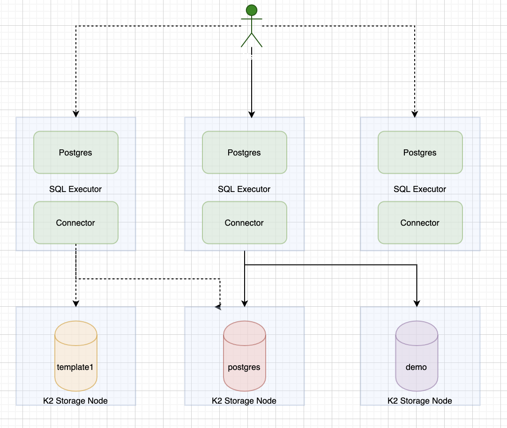
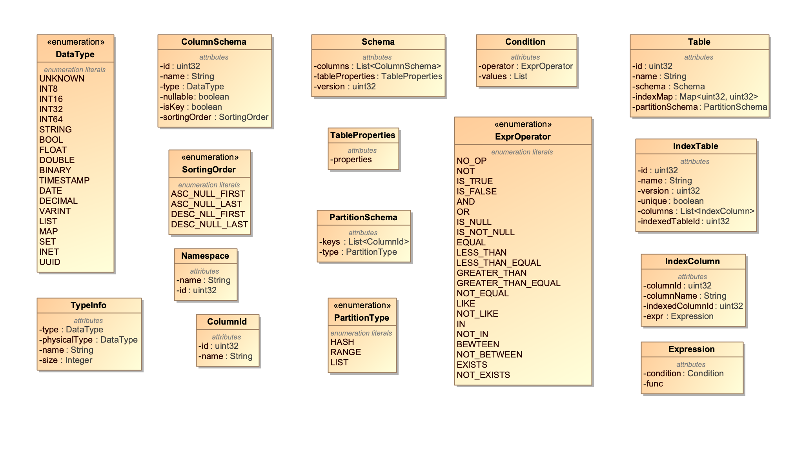
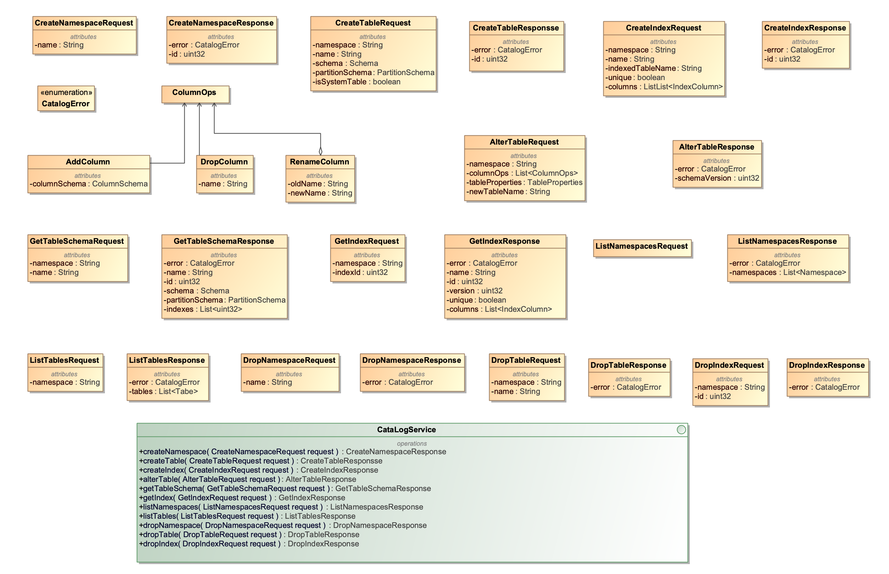

This document is a design proposal for the K2 SQL layer. It is a working in progress. 

# Introduction

## Assumptions 
K2 platform is an in-memory document storage system. We introduce a SQL layer on top of so that users could interactive with our system using SQLs.

The design is based on the following Assumptions:
* K2 Platform provides document APIs so that the SQL layers could access the table rows and columns with column projections and predicate pushdown
* For the first version of prototype, we will integrate Postgres (PG) database engine for query parsing, planning, and execution. That is to say, the query
execution is on a single PG instance, which might not be ideal for complex queries, but should work for most OLTP queries. 
* However, we should make our design to be extensible to be able to run queries in a distributed fashion, i.e., a physical query plan could be split
into multiple segments to run on different nodes, which is useful for HTAP (Hybrid transaction/analytical processing) and OLAP in the future.
* Data persistency and consistency is guaranteed by the K2 storage layer
* Each table has a primary key and we need to specify one if it is not provided in schema definition. 
* Primary keys that are used to partition tables cannot be changed once they are defined. 
* *DDL schema updates are transactional, but schema migrations are not transactional*.

## Design Goals
We like to achieve the following goals for the first version of prototype.
* Support Catalog management by DDLs, i.e., create, update, and delete database and tables
* Support secondary indexes 
* Support select with column projection and predication pushdown. Aggregation pushdown could be implemented in later versions.
* Support insert, update, delete, truncate, and simple joins
* Allow users to submit queries using PG libpq interface. JDBC and ODBC drivers could be provided in later versions. 

# System Design Proposal 

This is a high level design. More details will be added as we move forward.

## Architecture 

The system architecture is as follows and it consists of the following components.
* The storage layer provides document APIs so that we could storage data with data type information, table schemas, and secondary indexes into it.
* On the top of the storage layer, we have SQL executor, which could run separately on different hosts.

When the SQL system first starts, one of the SQL executors creates the template0 and the template1 template databases for Postgres, it also creates a default database called postgres. A user could create a new database, for example, demo, by copying it from the template1 database.  

## SQL Executor 

A more detailed view of SQL executor is shown by the following diagram.

### Postgres 

We could adopt the modified version of PG from [YugaByteDB](https://github.com/futurewei-cloud/chogori-sql/blob/master/docs/YugabyteDb.md), which has the following customization
* Modified the initdb.c to not create system databases and tables locally and relies on an external catalog manager instead. In this way, the Postgres is stateless.
* Wired in a Foreign Data Wrapper (DFW) to scan data from an external data source instead of local memory and disk.
* Changed PG commands to call external catalog manager 
* Changed Index Scan to read from external data source.
* Updated caching logic for external data sources 
* Implemented sequence support 
* Implemented column projection and predicate pushdown to external data sources
* Implemented aggression pushdown for min, max, sum, and count
* Used the [PG Gate APIs](https://github.com/futurewei-cloud/chogori-sql/blob/master/src/k2/postgres/src/include/yb/yql/pggate/ybc_pggate.h) to interact
with external catalog manager and data sources.

However, we need to customize the Postgres for our own needs.
* Update the SQL grammar [gram.y](https://github.com/futurewei-cloud/chogori-sql/blob/master/src/k2/postgres/src/backend/parser/gram.y) to only enable
the SQL syntax that we support
* Remove/disable the colocated table logic
* Remove the tablet logic, which was part of YugaByteDB's storage component
* Disable aggression push down for now until we support them in K2 storage layer
* Update the transaction logic to integrate with [K23SI transaction protocol](https://github.com/futurewei-cloud/chogori-platform/blob/master/docs/TXN.md)
* Need to check if we could support sequence  

### K2 Connector 

The K2 connector behaves similar to the PG Gate in YugaByteDB and it is a glue layer between Postgres and storage layer. However, we need 
rewrite our own connector logic since YugaByteDB's PG Gate is heavily coupled with its catalog system, tablet service, and its own transaction control 
logic. We need to implement the PG Gate APIs using our own logic.

Whenever the K2 connector receives API calls from PG, it dispatches the calls to DDL handler or DML handler depending on the call type. The 
DDL or DML handler creates a session for a SQL statement to allocate memory to cache schema and other data and set up client connection to the K2 storage layer. They also have logic to bind columns and expressions to table and then make calls to catalog manager if necessary. Some operations are done in-memory, for example, column bindings. The session is closed and cache is validated once a SQL statement finishes.

#### Catalog Manager

The catalog manager runs on each SQL executor and it is responsible for 
* initializes, creates, and saves PG system databases and tables to K2 storage layer, for example, all the [system catalog](https://www.postgresql.org/docs/11/catalogs.html) for template1, template0, and postgres
* manages user databases and tables such as create, insert, update, delete, and truncate.
* provides catalog APIs for DML handler and DDL handler 
* caches table schemas locally to avoid fetching them from remote
* Call K2 document APIs to store/update/delete documents on K2 storage layers for system/user databases, tables, and indexes. 

When user creates a database, the catalog manager generates a database oid (object id) and the tables in a database are assigned with table oids, which could be used to map a collection in K2 storage layer. The table primary key(s) should be used to locate the record in a K2 collection. 

##### Bootstrap

When the SQL Executor first starts up, it needs to initialize the catalog system if it has not already been done and internal data.
* System catalogs
* Existing user tables in a database
* Internal states such as whether initDB is finished or not and other system configuration

Postgres consists of a set of system catalogs as described in [PG doc](https://www.postgresql.org/docs/current/catalogs.html). All the catalogs start with the 
"pg_" prefix. Meanwhile, The [information schema](https://www.postgresql.org/docs/11/information-schema.html) consists of a set of views that contain information about the objects defined in the current database. The information schema is defined in the SQL standard and can therefore be expected to be portable and remain stable — unlike the system catalogs, which are specific to PostgreSQL and are modeled after implementation concerns. The information schema views do not, however, contain information about PostgreSQL-specific features. The views are defined in this [sql](https://github.com/futurewei-cloud/chogori-sql/blob/master/src/k2/postgres/src/backend/catalog/information_schema.sql).

For Postgres, it always creates a new database from templates. The two templates are [template0 and template1](https://www.postgresql.org/docs/11/manage-ag-templatedbs.html), where template0 is never changed after the PG cluster starts and template1 includes other changes. By default, PG copies the standard system database named template1. As a result, when a cluster starts up, template0, template1, and the default database postgres need to be created first. Each database consists a set of system catalogs, where both system table schemas and user table schemas are stored. For example, all relations are stored in pg_class table and the columns are stored in pg_attribute. The pg_tables is an view of the tables and pg_database holds all databases.

##### Caching

Postgres supports the following caches and it has been updated to [refresh caches](https://github.com/yugabyte/yugabyte-db/commit/6fec2ecda4240c633d0a3820495cd2f803a3033b) whenever the system catalog version increases.
* System catalog cache for tuples matching a key: [src/backend/utils/cache/catcache.c](https://github.com/futurewei-cloud/chogori-sql/blob/master/src/k2/postgres/src/backend/utils/cache/catcache.c)
* Relation descriptor cache: [src/backend/utils/cache/relcache.c](https://github.com/futurewei-cloud/chogori-sql/blob/master/src/k2/postgres/src/backend/utils/cache/relcache.c)
* System cache: [src/backend/utils/cache/syscache.c](https://github.com/futurewei-cloud/chogori-sql/blob/master/src/k2/postgres/src/backend/utils/cache/syscache.c)
* Query plan cache: [src/backend/utils/cache/plancache.c](https://github.com/futurewei-cloud/chogori-sql/blob/master/src/k2/postgres/src/backend/utils/cache/plancache.c)

Catalog manager holds id-table, name-table, id-indexTable maps for the default database when it first starts. Once the user changes to use a different database, catalog manager refreshes its cache to store the id-table, name-table, id-indexTable maps for the new databases. In additional, all database names and ids are cached to avoid access the shared system catalog aggressively. All caches are refreshed after the TTL expires or catalog manager detects a mismatch of the system catalog version.

##### Schema Entities

The entities for SQL schemas are shown in the following class diagram.
* Namespace: database
* DataType: data types that support [PG SQL data types](https://www.postgresql.org/docs/11/datatype.html)
* TypeInfo: used internally to resolve a SQL type to a physical type, i.e., c/c++ data type
* ColumnId: consists of column name and column id, which is generated by the system
* SortingOrder: the column sorting order, which could be used during index build
* ColumnSchema: the [column definition](https://www.postgresql.org/docs/11/infoschema-columns.html), where isKey indicates if this column is part of the primary key
* PartitionType: PG supports [Hash, Range, and List partitions](https://www.postgresql.org/docs/11/ddl-partitioning.html). We need to decide how do we 
support table partitions since storage layer might partition the table with split and join automatically
* PartitionSchema: partition schema for a table
* TableProperties: we need to decide what properties that we need to introduce
* Schema: the schema for a table row with table properties. Schema is versioned.
* ExprOperator: all expression types in SQL where clauses and index definitions
* Condition: a typical conditional expression
* Expression: it consists of different types of expression, for example, Condition, or a build-in function such as lower() or floor(). We need to decide whether we support them in K2 storage layer
* IndexColumn: the column involved in an index
* IndexTable: PG stores the [secondary indexes](https://www.postgresql.org/docs/11/indexes.html) as separate IndexTables. An index has its own system generated id, name, version, the table id that the index is built on, and whether it is unique. An index could include one or more columns
* Table: the table information that is maintained by the catalog manger and it consists of table name, system generated table id, table schema, partition schema, and an index map for secondary indexes

##### Catalog APIs 

Catalog APIs are used to manage databases, tables, and indexes. In the response object, an error code is returned if the API call fails.
* createNamespace(): create a database
* createTable(): create a table
* createIndex(): create an index
* *cloneTable(): clone a table from an existing table*
* alterTable(): change a table schema by adding columns, renaming columns, or dropping columns. The schema version is increased for each update
* getTableSchema(): get table schema including the index ids if they are available
* getIndex(): get index information
* listNamespaces(): return all databases for a user
* listTables(): return all tables in a database
* dropNamespace(): delete a database
* dropTable(): delete a table
* dropIndex(): delete an index

### K2 Storage

The SQL layer stores table schema, indexes, and data on K2 storage layer and it needs to scan the data or index on data nodes. 

#### SQL Document APIs

The K2 storage layer provides document APIs so that we could the K2 storage layer knows the data schema. As a result, we propose the following SQL document APIs, which is a wrapper layer in the SQL layer to call the native K2 storage APIs. The SQL document APIs could be used to update schema or fetch/update/delete records. Filters are used to filter out data during Index or data scan. A pagination token could be used to fetch records in batches. 

Multiple SQL Executor might try to initialize the system in parallel, to avoid that, we introduce a conditionalUpdateRecord() API so that only one SQL executor could start the initialization, for example, by setting a flag. 

Whenever Postgres creates a database, it first copies all the system catalogs from the template1 template database. To make this database copy more efficient,
we could introduce a clonePartition() API to clone the partition inside K2 storage to avoid reading/writing data in/out of the K2 storage layer.

#### K2 Storage APIs

We need to convert the SQL document APIs to native K2 storage APIs to access data on K2 storage layer. Apart from that, we also need to encode the record
properly so that the storage layer could decode the data, and vice verse. We like to adopt the [encoding schema](https://github.com/cockroachdb/cockroach/blob/master/docs/tech-notes/encoding.md) in cockroachDB.

#### Persistence

The following diagram illustrates the persistence of SQL schema and data in our system.
* Map a database to a K2 collection, table id is part of the partition key
* The SQL executor initializes the system by first creating two template databases, i.e., template0 and template1. We also persist configuration such as system catalog version and a flag to indicate if the system has been initialized or not
* The SQL executor then creates a default database postgres such that all users use this database by default
* User table schemas are stored in system catalog in the database. User table data and index data are stored in the same collection
* If a user creates a new database, a new collection is created and system catalog in database template1 is copied into the new collection. New table schemas, data, and indexes are stored into the same collection.
* However, some of the system catalogs such as pg_database are shared, i.e., its content is for all databases. In our storage model, it would make the update very inefficient if each collection holds its own pg_database. As a result, we might only put shared system catalog tables such as pg_database in template1. To prevent the shared system catalogs becoming a hot spot for the storage layer, the catalog manager in SQL executor should cache them.

