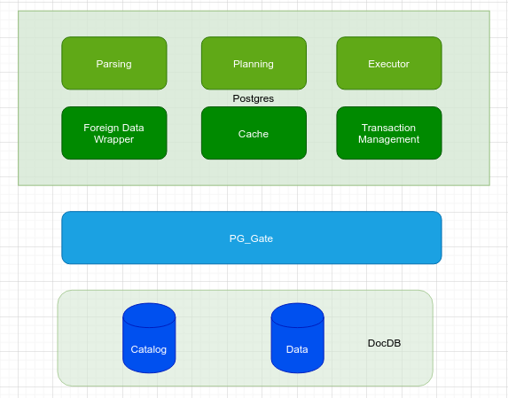
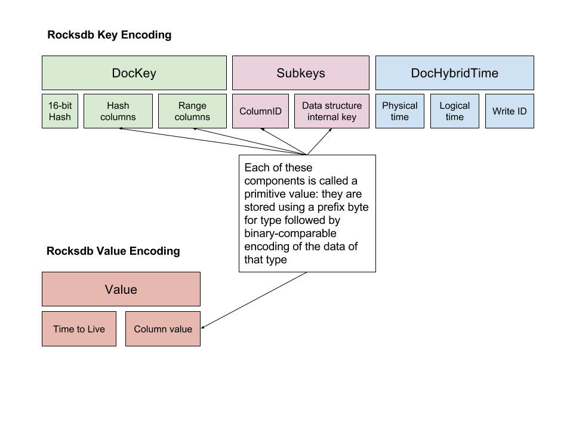
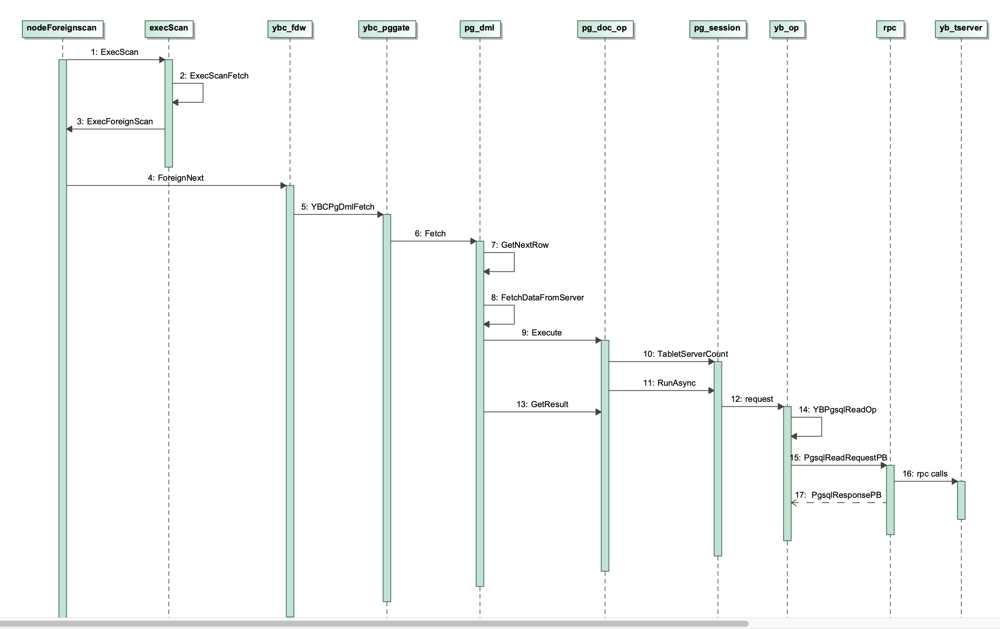
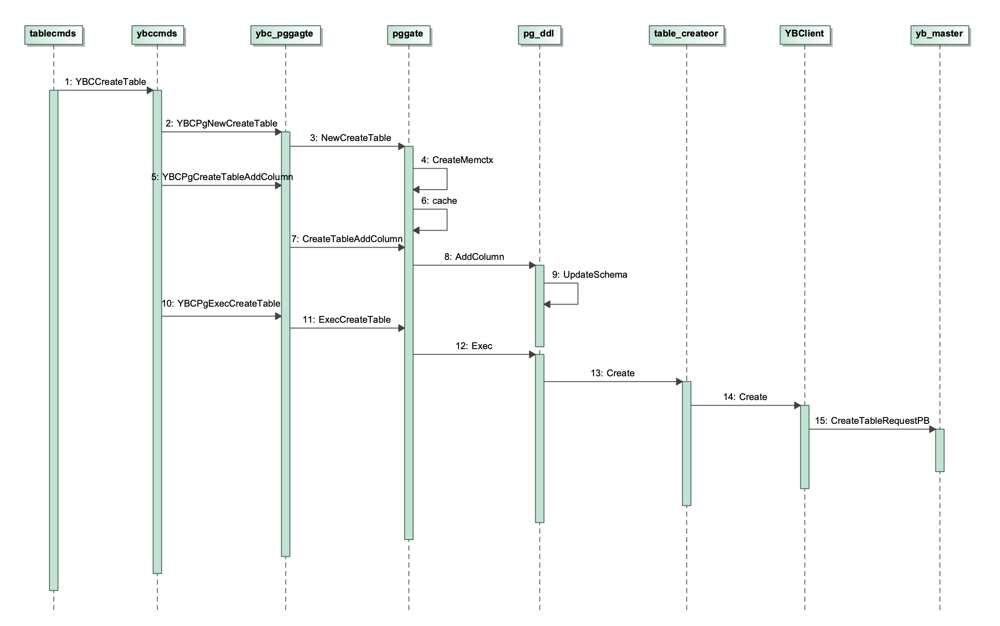

This document describes how YugbytesDb integrates with Postgres

# Introduction
Chorgori platform is built for low-latency in-memory distributed persistent OLTP databases. With the K2 storage layer in place, we need to add a 
SQL layer on top of it so that people could run SQL to interact with it. This type of SQL is fundamentally different from the traditional SQL databases
in that
* The database is distributed, not a simple sharding system of a single instance traditional database, which is hard and painful to manage. 
Instead, the system is automatically partitioned without manual efforts. 
* It supports strong consistency with distributed transactions 
* It supports GEO distributed transactions
* It scales with big data in mind

There are many of this types of so-called NewSQL projects that are inspired by the Google [Spinner paper](https://static.googleusercontent.com/media/research.google.com/en//archive/spanner-osdi2012.pdf) and 
the subsequent [F1 paper](https://static.googleusercontent.com/media/research.google.com/en//pubs/archive/41344.pdf). YugabyteDb is one of them and it was built as 
a DocDB at first with the support of Cassandra CQL language and Redis APIs from 2016. Postgres 10 was integrated in 2018 and then was upgraded to 11.2. 
The supported features can be found at https://docs.yugabyte.com/latest/api/ysql/. It could support [GraphQL](https://docs.yugabyte.com/latest/develop/graphql/) as well. 
Even our system is fundamentally different, YugaByteDB is a good reference implementation to help us for initial investigations.

# Integration

## Architecture
The integration is illustrated from high level by the following diagram.



That is to say, postgres was customized to communicate with YugaByteDB's DocDB via a layer called PG Gate. 

## Postgres Process

First of all, a Postgres process runs together with a [yb-tserver](https://docs.yugabyte.com/latest/architecture/concepts/yb-tserver/) (tablet server) on the storage node in YugabyteDb. More specifically, 
postgres was started as a child process of yb-tserver. Please check the commit history of [pg_wrapper.cc](https://github.com/yugabyte/yugabyte-db/commits/master/src/yb/yql/pgwrapper/pg_wrapper.cc). 

The [initdb.c](https://github.com/yugabyte/yugabyte-db/commits/master/src/postgres/src/bin/initdb/initdb.c) is called to initialize Postgres installation. 
YugaByteDB is more complicated for Postgres initialization since its catalog manager is on [yb-master](https://docs.yugabyte.com/latest/architecture/concepts/yb-master/) nodes and it needs to setup system tables on catalog manager.  The reasons are as follows as implemented by this [commit](https://github.com/yugabyte/yugabyte-db/commit/ca30a3ab5252858103cf6f3f92697821e9b718df)
* Create Postgres catalog tables on yb-master during initdb, and use them for all Postgres catalog read and writes.
* the Postgres instances running on each node are now virtually stateless and no local files are created/used for either system or user tables
* This ensures metadata consistency and high-availability in case of master/node failures
* However, this has an effect on performance of DDL statements as metadata lookups can be non-local but this is mitigated by more aggressive caching -- and should not affect steady-state DML statements.

The processes on a yb-server is shown as follows.

```
# ps axvww
    PID TTY      STAT   TIME  MAJFL   TRS   DRS   RSS %MEMOMMAND
      1 ?        Ssl   42:34     96   127 6395208 2343528  7.1 /home/yugabyte/bin/yb-tserver --fs_data_dirs=/mnt/data0 --rpc_bind_addresses=yb-tserver-0.yb-tservers.test.svc.cluster.local:9100 --server_broadcast_addresses=yb-tserver-0.yb-tservers.test.svc.cluster.local:9100 --enable_ysql=true --pgsql_proxy_bind_address=10.1.41.19:5433 --use_private_ip=never --tserver_master_addrs=yb-master-0.yb-masters.test.svc.cluster.local:7100 --logtostderr
     37 ?        S      0:00      0  8575 422512 45680  0.1 /home/yugabyte/postgres/bin/postgres -D /mnt/data0/pg_data -p 5433 -h 10.1.41.19 -k  -c shared_preload_libraries=pg_stat_statements,yb_pg_metrics -c yb_pg_metrics.node_name=DEFAULT_NODE_NAME -c yb_pg_metrics.port=13000 -c config_file=/mnt/data0/pg_data/ysql_pg.conf -c hba_file=/mnt/data0/pg_data/ysql_hba.conf
     68 ?        Ssl    0:12      0  8575 496372 13768  0.0 postgres: YSQL webserver   
     70 ?        Ss     0:00      0  8575 422688 12112  0.0 postgres: checkpointer   
     71 ?        Ss     0:00      0  8575 266392 9708  0.0 postgres: stats collector   
```

The above could be viewed on a YugabyteDB cluster. To launch a mini YugaByteDB cluster, please follow the instructiond for [kubernetes](https://docs.yugabyte.com/latest/deploy/kubernetes/). Or you could
use [MicroK8s](https://ubuntu.com/tutorials/install-a-local-kubernetes-with-microk8s#1-overview) in Ubuntu to launch a local cluster using [this script](./kube/yb-test.yaml).

```
$ kubectl create namespace test
$ kubectl apply -f yb-test.yaml 
$ kubectl describe pods -n test
$ kubectl exec -it yb-tserver-0 -n test -- /home/yugabyte/bin/ysqlsh -h yb-tserver-0  --echo-queries
$ kubectl exec -it yb-master-0 -n test -- /bin/bash
```
After that, you could run [example SQLs](https://docs.yugabyte.com/latest/quick-start/explore-ysql/) or [TPC-C benchmark](https://docs.yugabyte.com/latest/benchmark/tpcc-ysql/). 

## Foreign Data Wrapper (FDW)

YugabyteDb data are external to Postgres and thus, it takes advantage of the [foreign data wrapper feature](https://wiki.postgresql.org/wiki/Foreign_data_wrappers) 
to hook in the data access logic in [src/backend/executor/ybc_fdw.c](https://github.com/futurewei-cloud/chogori-sql/blob/master/src/k2/postgres/src/backend/executor/ybc_fdw.c).

``` c
Datum ybc_fdw_handler()
{
        FdwRoutine *fdwroutine = makeNode(FdwRoutine);


        fdwroutine->GetForeignRelSize  = ybcGetForeignRelSize;
        fdwroutine->GetForeignPaths    = ybcGetForeignPaths;
        fdwroutine->GetForeignPlan     = ybcGetForeignPlan;
        fdwroutine->BeginForeignScan   = ybcBeginForeignScan;
        fdwroutine->IterateForeignScan = ybcIterateForeignScan;
        fdwroutine->ReScanForeignScan  = ybcReScanForeignScan;
        fdwroutine->EndForeignScan     = ybcEndForeignScan;

        /* TODO: These are optional but we should support them eventually. */
        /* fdwroutine->ExplainForeignScan = ybcExplainForeignScan; */
        /* fdwroutine->AnalyzeForeignTable = ybcAnalyzeForeignTable; */
        /* fdwroutine->IsForeignScanParallelSafe = ybcIsForeignScanParallelSafe; */

        PG_RETURN_POINTER(fdwroutine);
}

```
However, YugabyteDb did not use the regular FDW access path to define foreign tables since Postgres is customed to solely access its own data. 
As a result, shortcuts are used to access its catalog and data directly. For example, check the following code snippet in 
src/backend/foreign/foreign.c to access the FDW handler directly instead of reading it from catalogs, which should be the reason that YugabyteDb
is treated as native Postgres tables without additional foreign tables.

``` c
FdwRoutine * GetFdwRoutineForRelation(Relation relation, bool makecopy)
{
        FdwRoutine *fdwroutine;
        FdwRoutine *cfdwroutine;

        if (relation->rd_fdwroutine == NULL)
        {
                if (IsYBRelation(relation)) {
                        /* Get the custom YB FDW directly */
                        fdwroutine = (FdwRoutine *) ybc_fdw_handler();
                } else {
                        /* Get the info by consulting the catalogs and the FDW code */
                        fdwroutine = GetFdwRoutineByRelId(RelationGetRelid(relation));
                }

                /* Save the data for later reuse in CacheMemoryContext */
                cfdwroutine = (FdwRoutine *) MemoryContextAlloc(CacheMemoryContext, sizeof(FdwRoutine));
                memcpy(cfdwroutine, fdwroutine, sizeof(FdwRoutine));
                relation->rd_fdwroutine = cfdwroutine;


                /* Give back the locally palloc'd copy regardless of makecopy */
                return fdwroutine;
        }
    ...
}
```

Take the following YugabyteDb query execution plan as an example. The data sequential scan on the orders table used Foreign Scan wired in 
by FDW. However, the Index Scan is directly from memory. 

``` SQL
explain analyze SELECT users.id, users.name, users.email, orders.id, orders.total
          FROM orders INNER JOIN users ON orders.user_id=users.id
          LIMIT 10;
                                                           QUERY PLAN                                                           
--------------------------------------------------------------------------------------------------------------------------------
 Limit  (cost=0.00..2.14 rows=10 width=88) (actual time=1.101..5.222 rows=10 loops=1)
   ->  Nested Loop  (cost=0.00..213.89 rows=1000 width=88) (actual time=1.100..5.216 rows=10 loops=1)
         ->  Foreign Scan on orders  (cost=0.00..100.00 rows=1000 width=24) (actual time=0.670..0.683 rows=10 loops=1)
         ->  Index Scan using users_pkey on users  (cost=0.00..0.11 rows=1 width=72) (actual time=0.425..0.425 rows=1 loops=10)
               Index Cond: (id = orders.user_id)
 Planning Time: 12.095 ms
 Execution Time: 5.314 ms
```

## PG Gate 

YugabyteDB uses DocDB on top of RocksDB to store data in a document format on storage layer. The data consists of Catalog, i.e., system databases/tables and user 
databases/tables, and table data. To minimize the code change on Postgres, YugabyteDb introduced a PG gate to abstract all the interaction with 
the DocDB layer. The API from Postgres side is defined in yb/yql/pggate/ybc_pggate.h. For example,

``` c++
// This must be called exactly once to initialize the YB/PostgreSQL gateway API before any other
// functions in this API are called.
void YBCInitPgGate(const YBCPgTypeEntity *YBCDataTypeTable, int count, YBCPgCallbacks pg_callbacks);
void YBCDestroyPgGate();

//--------------------------------------------------------------------------------------------------
// Environment and Session.

// Initialize ENV within which PGSQL calls will be executed.
YBCStatus YBCPgCreateEnv(YBCPgEnv *pg_env);
YBCStatus YBCPgDestroyEnv(YBCPgEnv pg_env);

// Initialize a session to process statements that come from the same client connection.
YBCStatus YBCPgInitSession(const YBCPgEnv pg_env, const char *database_name);

// Connect database. Switch the connected database to the given "database_name".
YBCStatus YBCPgConnectDatabase(const char *database_name);

// Create and drop table "database_name.schema_name.table_name()".
// - When "schema_name" is NULL, the table "database_name.table_name" is created.
// - When "database_name" is NULL, the table "connected_database_name.table_name" is created.
YBCStatus YBCPgNewCreateTable(const char *database_name,
                              const char *schema_name,
                              const char *table_name,
                              YBCPgOid database_oid,
                              YBCPgOid table_oid,
                              bool is_shared_table,
                              bool if_not_exist,
                              bool add_primary_key,
                              const bool colocated,
                              YBCPgStatement *handle);

// Create and drop index "database_name.schema_name.index_name()".
// - When "schema_name" is NULL, the index "database_name.index_name" is created.
// - When "database_name" is NULL, the index "connected_database_name.index_name" is created.
YBCStatus YBCPgNewCreateIndex(const char *database_name,
                              const char *schema_name,
                              const char *index_name,
                              YBCPgOid database_oid,
                              YBCPgOid index_oid,
                              YBCPgOid table_oid,
                              bool is_shared_index,
                              bool is_unique_index,
                              bool if_not_exist,
                              YBCPgStatement *handle);

// This function returns the tuple id (ybctid) of a Postgres tuple.
YBCStatus YBCPgDmlBuildYBTupleId(YBCPgStatement handle, const YBCPgAttrValueDescriptor *attrs,
                                 int32_t nattrs, uint64_t *ybctid);

// SELECT 
YBCStatus YBCPgNewSelect(YBCPgOid database_oid,
                         YBCPgOid table_oid,
                         const YBCPgPrepareParameters *prepare_params,
                         YBCPgStatement *handle);

// Transaction control -----------------------------------------------------------------------------
YBCStatus YBCPgBeginTransaction();
YBCStatus YBCPgRestartTransaction();
YBCStatus YBCPgCommitTransaction();
YBCStatus YBCPgAbortTransaction();
YBCStatus YBCPgSetTransactionIsolationLevel(int isolation);

```
## Type Conversion

When acess data to and from DocDB, data types need to be converted between Postgres and DocDB. The type conversion is defined in 
[src/include/catalog/ybctype.h](https://github.com/futurewei-cloud/chogori-sql/blob/master/src/k2/postgres/src/include/catalog/ybctype.h).

``` c
extern const YBCPgTypeEntity *YBCDataTypeFromName(TypeName *typeName);
extern const YBCPgTypeEntity *YBCDataTypeFromOidMod(int attnum, Oid type_id);
bool YBCDataTypeIsValidForKey(Oid type_id);
void YBCGetTypeTable(const YBCPgTypeEntity **type_table, int *count);
```
More methods are implemented in [src/backend/catalog/ybctype.c](https://github.com/futurewei-cloud/chogori-sql/blob/master/src/k2/postgres/src/backend/catalog/ybctype.c), for example,

``` c
void YBCDatumToBool(Datum datum, bool *data, int64 *bytes) {
	*data = DatumGetBool(datum);
}
void YBCDatumToBinary(Datum datum, void **data, int64 *bytes) {
	*data = VARDATA_ANY(datum);
	*bytes = VARSIZE_ANY_EXHDR(datum);
}
```

## Catalog Access 

On top of the YugabyteDB defined methods to access system catalogs in [src/backend/access/ybcam.h](https://github.com/futurewei-cloud/chogori-sql/blob/master/src/k2/postgres/src/include/access/ybcam.h) so that they can be 
called by executors,

``` c
/*
 * Access to YB-stored system catalogs (mirroring API from genam.c)
 * We ignore the index id and always do a regular YugaByte scan (Postgres
 * would do either heap scan or index scan depending on the params).
 */
extern SysScanDesc ybc_systable_beginscan(Relation relation,
										  Oid indexId,
										  bool indexOK,
										  Snapshot snapshot,
										  int nkeys,
										  ScanKey key);
extern HeapTuple ybc_systable_getnext(SysScanDesc scanDesc);
extern void ybc_systable_endscan(SysScanDesc scan_desc);

/*
 * Access to YB-stored system catalogs (mirroring API from heapam.c)
 * We will do a YugaByte scan instead of a heap scan.
 */
extern HeapScanDesc ybc_heap_beginscan(Relation relation,
                                       Snapshot snapshot,
                                       int nkeys,
                                       ScanKey key,
									   bool temp_snap);
extern HeapTuple ybc_heap_getnext(HeapScanDesc scanDesc);
extern void ybc_heap_endscan(HeapScanDesc scanDesc);

/*
 * The ybc_idx API is used to process the following SELECT.
 *   SELECT data FROM heapRelation WHERE rowid IN
 *     ( SELECT rowid FROM indexRelation WHERE key = given_value )
 */
YbScanDesc ybcBeginScan(Relation relation,
                        Relation index,
                        bool xs_want_itup,
                        int nkeys,
                        ScanKey key);

HeapTuple ybc_getnext_heaptuple(YbScanDesc ybScan, bool is_forward_scan, bool *recheck);
IndexTuple ybc_getnext_indextuple(YbScanDesc ybScan, bool is_forward_scan, bool *recheck);

void ybcEndScan(YbScanDesc ybScan);
```

Similarily, index access is defined in [src/include/access/ybcin.h](https://github.com/futurewei-cloud/chogori-sql/blob/master/src/k2/postgres/src/include/access/ybcin.h).

``` c
extern IndexBuildResult *ybcinbuild(Relation heap, Relation index, struct IndexInfo *indexInfo);
extern void ybcinbuildempty(Relation index);
extern bool ybcininsert(Relation rel, Datum *values, bool *isnull, Datum ybctid, Relation heapRel,
						IndexUniqueCheck checkUnique, struct IndexInfo *indexInfo);
extern void ybcindelete(Relation rel, Datum *values, bool *isnull, Datum ybctid, Relation heapRel,
						struct IndexInfo *indexInfo);
extern bool ybcinvalidate(Oid opclassoid);
...
extern IndexScanDesc ybcinbeginscan(Relation rel, int nkeys, int norderbys);
extern void ybcinrescan(IndexScanDesc scan, ScanKey scankey, int nscankeys,
						ScanKey orderbys, int norderbys);
extern bool ybcingettuple(IndexScanDesc scan, ScanDirection dir);
extern void ybcinendscan(IndexScanDesc scan);
```

## Pushdowns
YugaByteDB supports multiple [pushdowns](https://blog.yugabyte.com/5-query-pushdowns-for-distributed-sql-and-how-they-differ-from-a-traditional-rdbms/) during scanning phase to improve performance. 
For example, Yugabyte support for aggregate pushdowns to DocDB for COUNT/MAX/MIN/SUM in this [commit](https://github.com/yugabyte/yugabyte-db/commit/e554bda510cefbe612a00883c0285fe77447039e).

The pushdown happens only if the following conditions are met:
* Outer plan is a YB foreign scan.
* No `WHERE` clause.
* No `ORDER BY`, `GROUP BY`, `DISTINCT`, or `FILTER`.
* Aggregates are one of: `COUNT`/`MIN`/`MAX`/`SUM`.
* Aggregate output type (i.e. transition type) is a supported YB key type and not a postgres internal or numeric type.
* Column type is a supported YB key type.

The pushdown logic is mainly in [src/backend/executor/nodeAgg.c](https://github.com/futurewei-cloud/chogori-sql/blob/master/src/k2/postgres/src/backend/executor/nodeAgg.c).

``` c 
/*
 * Evaluates whether plan supports pushdowns of aggregates to DocDB, and sets
 * yb_pushdown_supported accordingly in AggState.
 */
static void yb_agg_pushdown_supported(AggState *aggstate)
{
	ForeignScanState *scan_state;
	ListCell *lc_agg;
	ListCell *lc_arg;

	/* Initially set pushdown supported to false. */
	aggstate->yb_pushdown_supported = false;

	/* Phase 0 is a dummy phase, so there should be two phases. */
	if (aggstate->numphases != 2)
		return;

	/* Plain agg strategy. */
	if (aggstate->phase->aggstrategy != AGG_PLAIN)
		return;

	/* No GROUP BY. */
	if (aggstate->phase->numsets != 0)
		return;

	/* Foreign scan outer plan. */
	if (!IsA(outerPlanState(aggstate), ForeignScanState))
		return;

	scan_state = castNode(ForeignScanState, outerPlanState(aggstate));

	/* Foreign relation we are scanning is a YB table. */
	if (!IsYBRelationById(scan_state->ss.ss_currentRelation->rd_id))
		return;

	/* No WHERE quals. */
	if (scan_state->ss.ps.qual)
		return;

	foreach(lc_agg, aggstate->aggs)
	{
		AggrefExprState *aggrefstate = (AggrefExprState *) lfirst(lc_agg);
		Aggref *aggref = aggrefstate->aggref;
		char *func_name = get_func_name(aggref->aggfnoid);

		/* Only support COUNT/MIN/MAX/SUM. */
		if (strcmp(func_name, "count") != 0 &&
			strcmp(func_name, "min") != 0 &&
			strcmp(func_name, "max") != 0 &&
			strcmp(func_name, "sum") != 0)
			return;

		/* No ORDER BY. */
		if (list_length(aggref->aggorder) != 0)
			return;

		/* No DISTINCT. */
		if (list_length(aggref->aggdistinct) != 0)
			return;

		/* No FILTER. */
		if (aggref->aggfilter)
			return;

		/* No array arguments. */
		if (aggref->aggvariadic)
			return;

		/* Normal aggregate kind. */
		if (aggref->aggkind != AGGKIND_NORMAL)
			return;

		/* Does not belong to outer plan. */
		if (aggref->agglevelsup != 0)
			return;

		/* Simple split. */
		if (aggref->aggsplit != AGGSPLIT_SIMPLE)
			return;

		/* Aggtranstype is a supported YB key type and is not INTERNAL or NUMERIC. */
		if (!YBCDataTypeIsValidForKey(aggref->aggtranstype) ||
			aggref->aggtranstype == INTERNALOID ||
			aggref->aggtranstype == NUMERICOID)
			return;

		foreach(lc_arg, aggref->args)
		{
			TargetEntry *tle = lfirst_node(TargetEntry, lc_arg);

			/* Only support simple column expressions until DocDB can eval PG exprs. */
			if (!IsA(tle->expr, Var))
				return;

			/*
			 * Only support types that are allowed to be YB keys as we cannot guarantee
			 * we can safely perform postgres semantic compatible DocDB aggregate evaluation
			 * otherwise.
			 */
			if (!YBCDataTypeIsValidForKey(castNode(Var, tle->expr)->vartype))
				return;
		}
	}

	/* If this is reached, YB pushdown is supported. */
	aggstate->yb_pushdown_supported = true;
}

/*
 * Populates aggregate pushdown information in the YB foreign scan state.
 */
static void yb_agg_pushdown(AggState *aggstate)
{
	ForeignScanState *scan_state = castNode(ForeignScanState, outerPlanState(aggstate));
	List *pushdown_aggs = NIL;
	int aggno;

	for (aggno = 0; aggno < aggstate->numaggs; aggno++)
	{
		Aggref *aggref = aggstate->peragg[aggno].aggref;

		pushdown_aggs = lappend(pushdown_aggs, aggref);
	}
	scan_state->yb_fdw_aggs = pushdown_aggs;
}
```
This [commit](https://github.com/yugabyte/yugabyte-db/commit/05a53869165ac8b9719751234d0eb940da8e58ba) proposed expression pushdowns.

## IsYugaByteEnabled() Flag

YugbytesDb changed Postgres internal logic a lot. To make the code clear, a flag is introduced in [src/include/pg_yb_utils.h](https://github.com/futurewei-cloud/chogori-sql/blob/master/src/k2/postgres/src/include/pg_yb_utils.h) to indicate the logic path for YugaByteDB.

``` c 
/*
 * Checks whether YugaByte functionality is enabled within PostgreSQL.
 * This relies on pgapi being non-NULL, so probably should not be used
 * in postmaster (which does not need to talk to YB backend) or early
 * in backend process initialization. In those cases the
 * YBIsEnabledInPostgresEnvVar function might be more appropriate.
 */
extern bool IsYugaByteEnabled();
```
The flag is set if pggate::PgApiImpl is initialized in [/yb/pggate/ybc_pggate.cc](https://github.com/yugabyte/yugabyte-db/blob/master/src/yb/yql/pggate/ybc_pggate.cc). 

## Caching

Postgres supports the following caches:
* System catalog cache for tuples matching a key: src/backend/utils/cache/catcache.c
* Relation descriptor cache: src/backend/utils/cache/relcache.c
* System cache: src/backend/utils/cache/syscache.c
* Query plan cache: src/backend/utils/cache/plancache.c

The caching logic is updated for YugaByteDB based on the above IsYugaByteEnabled() flag. For example, check the following 
code snippet in catcache.c.

``` c
		/*
		 * Disable negative entries for YugaByte to handle case where the entry
		 * was added by (running a command on) another node.
		 * We also don't support tuple update as of 14/12/2018.
		 */
		if (IsYugaByteEnabled())
		{
			bool allow_negative_entries = cache->id == CASTSOURCETARGET ||
			                              (cache->id == RELNAMENSP &&
			                               DatumGetObjectId(cur_skey[1].sk_argument) ==
			                               PG_CATALOG_NAMESPACE &&
			                               !YBIsPreparingTemplates());
			if (!allow_negative_entries)
			{
				return NULL;
			}
		}

		ct = CatalogCacheCreateEntry(cache, NULL, arguments,
									 hashValue, hashIndex,
									 true);
```

## Sequence 

YugaByteDB enabled sequence support in this [commit](https://github.com/yugabyte/yugabyte-db/commit/c7310c1f23755552252f7ccf6307c148cc903aa0).

The following APIs are introduced in [yb/yql/pggate/ybc_pggate.h](https://github.com/yugabyte/yugabyte-db/blob/master/src/yb/yql/pggate/ybc_pggate.h).

``` c 
YBCStatus YBCInsertSequenceTuple(int64_t db_oid,
                                 int64_t seq_oid,
                                 uint64_t ysql_catalog_version,
                                 int64_t last_val,
                                 bool is_called);

YBCStatus YBCUpdateSequenceTupleConditionally(int64_t db_oid,
                                              int64_t seq_oid,
                                              uint64_t ysql_catalog_version,
                                              int64_t last_val,
                                              bool is_called,
                                              int64_t expected_last_val,
                                              bool expected_is_called,
                                              bool *skipped);

YBCStatus YBCUpdateSequenceTuple(int64_t db_oid,
                                 int64_t seq_oid,
                                 uint64_t ysql_catalog_version,
                                 int64_t last_val,
                                 bool is_called,
                                 bool* skipped);

YBCStatus YBCReadSequenceTuple(int64_t db_oid,
                               int64_t seq_oid,
                               uint64_t ysql_catalog_version,
                               int64_t *last_val,
                               bool *is_called);

YBCStatus YBCDeleteSequenceTuple(int64_t db_oid, int64_t seq_oid);

```
## Catalog Manager

The catalog manager in YugaByteDB is running on [yb-master](https://docs.yugabyte.com/latest/architecture/concepts/yb-master/), which stores system metadata such as the information about all the namespaces, tables, roles, permissions, and assignment of tablets to 
yb-tservers. These system records are replicated across the yb-masters for redundancy using Raft as well. The system metadata is also stored 
as a DocDB table by the yb-masters.

As explained by this [readme](https://github.com/yugabyte/yugabyte-db/blob/2.2.0/src/yb/master/README), the Catalog Manager keeps track of the tables and tablets defined by the
user in the cluster. All the table and tablet information is stored in-memory in copy-on-write TableInfo / TabletInfo objects, as well as on-disk, in the "sys.catalog"
system table hosted only on the Masters.  This system table is loaded into memory on Master startup.  At the time of this writing, the "sys.catalog"
table consists of only a single tablet in order to provide strong consistency for the metadata under RAFT replication (as currently, each tablet has its own
log).

To add or modify a table or tablet, the Master writes, but does not yet commit the changes to memory, then writes and flushes the system table to disk, and
then makes the changes visible in-memory (commits them) if the disk write (and, in a distributed master setup, config-based replication) is successful. This
allows readers to access the in-memory state in a consistent way, even while a write is in-progress.

The catalog manager maintains 3 hash-maps for looking up info in the sys table:
- [Table Id] -> TableInfo
- [Table Name] -> TableInfo
- [Tablet Id] -> TabletInfo

The TableInfo has a map [tablet-start-key] -> TabletInfo used to provide the tablets locations to the user based on a key-range request. 
The [TableInfo](https://github.com/yugabyte/yugabyte-db/blob/2.2.0/src/yb/tablet/tablet_metadata.h) is defined as follows.

``` c++
struct TableInfo {
  // Table id, name and type.
  std::string table_id;
  std::string table_name;
  TableType table_type;

  // The table schema, secondary index map, index info (for index table only) and schema version.
  Schema schema;
  IndexMap index_map;
  std::unique_ptr<IndexInfo> index_info;
  uint32_t schema_version = 0;

  // Partition schema of the table.
  PartitionSchema partition_schema;

  // A vector of column IDs that have been deleted, so that the compaction filter can free the
  // associated memory. As of 01/2019, deleted column IDs are persisted forever, even if all the
  // associated data has been discarded. In the future, we can garbage collect such column IDs to
  // make sure this vector doesn't grow too large.
  std::vector<DeletedColumn> deleted_cols;

  // We use the retention time from the primary table.
  uint32_t wal_retention_secs = 0;
};
```
where the Schema is defined as follows.

``` c++
// The schema for a set of rows.
//
// A Schema is simply a set of columns, along with information about
// which prefix of columns makes up the primary key.
//
// Note that, while Schema is copyable and assignable, it is a complex
// object that is not inexpensive to copy. You should generally prefer
// passing by pointer or reference, and functions that create new
// Schemas should generally prefer taking a Schema pointer and using
// Schema::swap() or Schema::Reset() rather than returning by value.
class Schema {
  vector<ColumnSchema> cols_;
  size_t num_key_columns_;
  size_t num_hash_key_columns_;
  ColumnId max_col_id_;
  vector<ColumnId> col_ids_;
  vector<size_t> col_offsets_;

  // The keys of this map are GStringPiece references to the actual name members of the
  // ColumnSchema objects inside cols_. This avoids an extra copy of those strings,
  // and also allows us to do lookups on the map using GStringPiece keys, sometimes
  // avoiding copies.
  //
  // The map is instrumented with a counting allocator so that we can accurately
  // measure its memory footprint.
  int64_t name_to_index_bytes_;
  typedef STLCountingAllocator<std::pair<const GStringPiece, size_t> > NameToIndexMapAllocator;
  typedef unordered_map<
      GStringPiece,
      size_t,
      std::hash<GStringPiece>,
      std::equal_to<GStringPiece>,
      NameToIndexMapAllocator> NameToIndexMap;
  NameToIndexMap name_to_index_;

  IdMapping id_to_index_;

  // Cached indicator whether any columns are nullable.
  bool has_nullables_;

  // Cached indicator whether any columns are static.
  bool has_statics_ = false;

  TableProperties table_properties_;

  // Uuid of the non-primary table this schema belongs to co-located in a tablet. Nil for the
  // primary or single-tenant table.
  Uuid cotable_id_;

  // PG table OID of the non-primary table this schema belongs to in a tablet with colocated
  // tables. Nil for the primary or single-tenant table.
  PgTableOid pgtable_id_;

  // NOTE: if you add more members, make sure to add the appropriate
  // code to swap() and CopyFrom() as well to prevent subtle bugs.
};
```
The ColumnSchema is as follows.

``` c++
// The schema for a given column.
//
// Holds the data type as well as information about nullability & column name.
// In the future, it may hold information about annotations, etc.
class ColumnSchema {
 public:
  enum SortingType : uint8_t {
    kNotSpecified = 0,
    kAscending,          // ASC, NULLS FIRST
    kDescending,         // DESC, NULLS FIRST
    kAscendingNullsLast, // ASC, NULLS LAST
    kDescendingNullsLast // DESC, NULLS LAST
  };

  // name: column name
  // type: column type (e.g. UINT8, INT32, STRING, MAP<INT32, STRING> ...)
  // is_nullable: true if a row value can be null
  // is_hash_key: true if a column's hash value can be used for partitioning.
  std::string name_;
  std::shared_ptr<QLType> type_;
  bool is_nullable_;
  bool is_hash_key_;
  bool is_static_;
  bool is_counter_;
  int32_t order_;
  SortingType sorting_type_;
};
```

and TableProperties

``` c++
class TableProperties {
  static const int kNoDefaultTtl = -1;
  int64_t default_time_to_live_ = kNoDefaultTtl;
  bool contain_counters_ = false;
  bool is_transactional_ = false;
  bool is_backfilling_ = false;
  YBConsistencyLevel consistency_level_ = YBConsistencyLevel::STRONG;
  TableId copartition_table_id_ = kNoCopartitionTableId;
  boost::optional<uint32_t> wal_retention_secs_;
  bool use_mangled_column_name_ = false;
  int num_tablets_ = 0;
  bool is_ysql_catalog_table_ = false;
};
```
and PartitionSchema

``` c++
class PartitionSchema {
  struct RangeSchema {
    std::vector<ColumnId> column_ids;
  };

  struct HashBucketSchema {
    std::vector<ColumnId> column_ids;
    int32_t num_buckets;
    uint32_t seed;
  };

  std::vector<HashBucketSchema> hash_bucket_schemas_;
  RangeSchema range_schema_;
  boost::optional<YBHashSchema> hash_schema_; // Defined only for table that is hash-partitioned.
};
```
and IndexMap is an unordered_map and IndexInfo is as follows.

``` c++
// A class to maintain the information of an index.
class IndexInfo {
 public:
  // Index column mapping.
  struct IndexColumn {
    ColumnId column_id;         // Column id in the index table.
    std::string column_name;    // Column name in the index table - colexpr.MangledName().
    ColumnId indexed_column_id; // Corresponding column id in indexed table.
    QLExpressionPB colexpr;     // Index expression.

    explicit IndexColumn(const IndexInfoPB::IndexColumnPB& pb);
    IndexColumn() {}
    void ToPB(IndexInfoPB::IndexColumnPB* pb) const;
  };
  const TableId table_id_;            // Index table id.
  const TableId indexed_table_id_;    // Indexed table id.
  const uint32_t schema_version_ = 0; // Index table's schema version.
  const bool is_local_ = false;       // Whether this is a local index.
  const bool is_unique_ = false;      // Whether this is a unique index.
  const std::vector<IndexColumn> columns_; // Index columns.
  const size_t hash_column_count_ = 0;     // Number of hash columns in the index.
  const size_t range_column_count_ = 0;    // Number of range columns in the index.
  const std::vector<ColumnId> indexed_hash_column_ids_;  // Hash column ids in the indexed table.
  const std::vector<ColumnId> indexed_range_column_ids_; // Range column ids in the indexed table.
  const IndexPermissions index_permissions_ = INDEX_PERM_READ_WRITE_AND_DELETE;

  // Column ids covered by the index (include indexed columns).
  std::unordered_set<ColumnId> covered_column_ids_;

  // Newer INDEX use mangled column name instead of ID.
  bool use_mangled_column_name_ = false;
};  
```
## DocDB to KV Store Mapping.
For YSQL tables, every row is a document in DocDB. DocDB stores the data in a document format and eventually, it needs to store the data in KV pairs in the underhood RocksDB. 
The storage models are described [here](https://docs.yugabyte.com/latest/architecture/docdb/persistence/). We copied the following diagram from the above document to 
better show the mapping between DocDB and RocksDB.



The keys in DocDB document model are compound keys consisting of one or more hash organized components, followed by zero or more ordered (range) 
components. These components are stored in their data type specific sort order; both ascending and descending sort order is supported for each 
ordered component of the key.

The values in DocDB document data model can be:
* primitive types: such as int32, int64, double, text, timestamp, etc.
* non-primitive types (sorted maps): These objects map scalar keys to values, which could be either scalar or sorted maps as well.
This model allows multiple levels of nesting, and corresponds to a JSON-like format. Other data structures like lists, sorted sets etc. are 
implemented using DocDB’s object type with special key encodings. In DocDB, hybrid timestamps of each update are recorded carefully, so that it is 
possible to recover the state of any document at some point in the past. Overwritten or deleted versions of data are garbage-collected as soon as 
there are no transactions reading at a snapshot at which the old value would be visible.

The above DocDB key is defined in [doc_key.h](https://github.com/yugabyte/yugabyte-db/blob/2.2.0/src/yb/docdb/doc_key.h) as follows.
``` c++
// A key that allows us to locate a document. This is the prefix of all RocksDB keys of records
// inside this document. A document key contains:
//   - An optional ID (cotable id or pgtable id).
//   - An optional fixed-width hash prefix.
//   - A group of primitive values representing "hashed" components (this is what the hash is
//     computed based on, so this group is present/absent together with the hash).
//   - A group of "range" components suitable for doing ordered scans.
//
// The encoded representation of the key is as follows:
//   - Optional ID:
//     * For cotable id, the byte ValueType::kTableId followed by a sixteen byte UUID.
//     * For pgtable id, the byte ValueType::kPgTableOid followed by a four byte PgTableId.
//   - Optional fixed-width hash prefix, followed by hashed components:
//     * The byte ValueType::kUInt16Hash, followed by two bytes of the hash prefix.
//     * Hashed components:
//       1. Each hash component consists of a type byte (ValueType) followed by the encoded
//          representation of the respective type (see PrimitiveValue's key encoding).
//       2. ValueType::kGroupEnd terminates the sequence.
//   - Range components are stored similarly to the hashed components:
//     1. Each range component consists of a type byte (ValueType) followed by the encoded
//        representation of the respective type (see PrimitiveValue's key encoding).
//     2. ValueType::kGroupEnd terminates the sequence.
using DocKeyHash = uint16_t;

class DocKey {
 // Uuid of the non-primary table this DocKey belongs to co-located in a tablet. Nil for the
  // primary or single-tenant table.
  Uuid cotable_id_;

  // Postgres table OID of the non-primary table this DocKey belongs to in colocated tables.
  // 0 for primary or single tenant table.
  PgTableOid pgtable_id_;

  // TODO: can we get rid of this field and just use !hashed_group_.empty() instead?
  bool hash_present_;

  DocKeyHash hash_;
  std::vector<PrimitiveValue> hashed_group_;
  std::vector<PrimitiveValue> range_group_;
};
```
and 
``` c++ 
// ------------------------------------------------------------------------------------------------
// SubDocKey
// ------------------------------------------------------------------------------------------------

// A key pointing to a subdocument. Consists of a DocKey identifying the document, a list of
// primitive values leading to the subdocument in question, from the outermost to innermost order,
// and an optional hybrid_time of when the subdocument (which may itself be a primitive value) was
// last fully overwritten or deleted.
//
// Keys stored in RocksDB should always have the hybrid_time field set. However, it is useful to
// make the hybrid_time field optional while a SubDocKey is being constructed. If the hybrid_time
// is not set, it is omitted from the encoded representation of a SubDocKey.
//
// Implementation note: we use HybridTime::kInvalid to represent an omitted hybrid_time.
// We rely on that being the default-constructed value of a HybridTime.
//
// TODO: this should be renamed to something more generic, e.g. Key or LogicalKey, to reflect that
// this is actually the logical representation of keys that we store in the RocksDB key-value store.
class SubDocKey {
  DocKey doc_key_;
  DocHybridTime doc_ht_;
  std::vector<PrimitiveValue> subkeys_;
};
```

The value SubDocument is defined as follows.
``` c++ 
class SubDocument : public PrimitiveValue {
}

class PrimitiveValue {
	static constexpr int64_t kUninitializedWriteTime = std::numeric_limits<int64_t>::min();

  // Column attributes.
  int64_t ttl_seconds_ = -1;
  int64_t write_time_ = kUninitializedWriteTime;

  // TODO: make PrimitiveValue extend SubDocument and put this field
  // in SubDocument.
  // This field gives the extension order of elements of a list and
  // is applicable only to SubDocuments of type kArray.
  mutable ListExtendOrder extend_order_ = ListExtendOrder::APPEND;

  ValueType type_;

  union {
    int32_t int32_val_;
    uint32_t uint32_val_;
    int64_t int64_val_;
    uint64_t uint64_val_;
    uint16_t uint16_val_;
    DocHybridTime hybrid_time_val_;
    std::string str_val_;
    float float_val_;
    double double_val_;
    Timestamp timestamp_val_;
    InetAddress* inetaddress_val_;
    Uuid uuid_val_;
    FrozenContainer* frozen_val_;
    // This is used in SubDocument to hold a pointer to a map or a vector.
    void* complex_data_structure_;
    ColumnId column_id_val_;
    std::string decimal_val_;
    std::string varint_val_;
    std::string json_val_;
  };
}
```
The keys are seralized to and from bytes when in use by using [DocKeyEncoder and DocKeyDecoder](https://github.com/yugabyte/yugabyte-db/blob/2.2.0/src/yb/docdb/doc_key.cc).

## Colocated Tables
YugabyteDB supports [colocating SQL tables](https://github.com/yugabyte/yugabyte-db/blob/master/architecture/design/ysql-colocated-tables.md) to avoid creating too many tables with small data sets. 
Colocating tables puts all of their data into a single tablet, called the colocated tablet. Here is the initial [commit](https://github.com/yugabyte/yugabyte-db/commit/6d332c9635edb474b66c5c3de6dba1afb76ef3c8).

## Transactions 

YugaByteDB changed quite a lot of logic in postgres transaction. The primary file is: [src/backend/access/transam/xact.c](https://github.com/yugabyte/yugabyte-db/blob/master/src/postgres/src/backend/access/transam/xact.c).
The commit history for this file is available [here](https://github.com/yugabyte/yugabyte-db/commits/master/src/postgres/src/backend/access/transam/xact.c)

Postgres supports [Explicit Locking](https://www.postgresql.org/docs/11/explicit-locking.html) on table level, row level, and page level. As a result,
it introduced a deadlock detection mechanism and a concept of *advisory locks*. The system does not enforce their use — it is up to the application to use them correctly.
YugaByteDB supports [row-level explict locking](https://docs.yugabyte.com/latest/architecture/transactions/explicit-locking/#types-of-row-level-locks), 
for example, *FOR UPDATE* and *FOR SHARE*.

## Parser

The parser and lexer are implemented using the well-known Unix tools [bison](https://www.gnu.org/software/bison/) and [flex](http://dinosaur.compilertools.net/).
The lexer is defined in the file scan.l and the parser grammar is defined in [src/backend/parser/gram.y](https://github.com/postgres/postgres/blob/master/src/backend/parser/gram.y).

YugaByteDB YSQL statements can be found [here](https://docs.yugabyte.com/latest/api/ysql/). The main changes to SQL grammar are the Introduction of *colocated* key word for colocated tables, for example,

``` SQL
CREATE DATABASE colocation_demo WITH colocated = true;
CREATE TABLE opt_out_1(a int, b int, PRIMARY KEY(a)) WITH (colocated = false);
```

YugaByteDB also added *SPLIT INTO* clause to specify the number of tablets to be created for the table and *SPLIT AT VALUES*
clause to set split points to pre-split range-sharded tables.

``` SQL
CREATE TABLE tracking (id int PRIMARY KEY) SPLIT INTO 10 TABLETS;

CREATE TABLE tbl(
  a int,
  b int,
  primary key(a asc, b desc)
) SPLIT AT VALUES((100), (200), (200, 5));
```

YugaByteDB supports the following statements

```
stmt :
			| AlterDatabaseSetStmt
			| AlterDatabaseStmt
			| AlterDomainStmt
			| AlterObjectSchemaStmt
			| AlterOperatorStmt
			| AlterOpFamilyStmt
			| AlterSeqStmt
			| AlterTableStmt
			| CallStmt
			| CommentStmt
			| ConstraintsSetStmt
			| CopyStmt
			| CreateCastStmt
			| CreateDomainStmt
			| CreateOpFamilyStmt
			| CreateSchemaStmt
			| CreateUserStmt
			| CreatedbStmt
			| DeallocateStmt
			| DefineStmt
			| DeleteStmt
			| DiscardStmt
			| DropCastStmt
			| DropOpFamilyStmt
			| DropStmt
			| DropdbStmt
			| ExecuteStmt
			| ExplainStmt
			| GrantStmt
			| IndexStmt
			| InsertStmt
			| LockStmt
			| PrepareStmt
			| RemoveAggrStmt
			| RemoveOperStmt
			| RenameStmt
			| RevokeStmt
			| RuleStmt
			| SelectStmt
			| TransactionStmt
			| TruncateStmt
			| UpdateStmt
			| VariableResetStmt
			| VariableSetStmt
			| VariableShowStmt
			| ViewStmt
```
The following are Beta features

```
			| AlterExtensionContentsStmt { parser_ybc_beta_feature(@1, "extension"); }
			| AlterExtensionStmt { parser_ybc_beta_feature(@1, "extension"); }
			| AnalyzeStmt { parser_ybc_beta_feature(@1, "analyze"); }
			| CreateFunctionStmt { parser_ybc_beta_feature(@1, "function"); }
			| CreateOpClassStmt { parser_ybc_beta_feature(@1, "opclass"); }
			| CreatePolicyStmt { parser_ybc_beta_feature(@1, "roles"); }
			| DoStmt { parser_ybc_beta_feature(@1, "function"); }
			| DropOpClassStmt { parser_ybc_beta_feature(@1, "opclass"); }
			| RemoveFuncStmt { parser_ybc_beta_feature(@1, "function"); }
			| CreateTrigStmt { parser_ybc_beta_feature(@1, "trigger"); }
			| CreateExtensionStmt { parser_ybc_beta_feature(@1, "extension"); }
			| AlterDefaultPrivilegesStmt { parser_ybc_beta_feature(@1, "roles"); }
			| AlterGroupStmt { parser_ybc_beta_feature(@1, "roles"); }
			| AlterOwnerStmt { parser_ybc_beta_feature(@1, "roles"); }
			| AlterPolicyStmt { parser_ybc_beta_feature(@1, "roles"); }
			| AlterRoleSetStmt { parser_ybc_beta_feature(@1, "roles"); }
			| AlterRoleStmt { parser_ybc_beta_feature(@1, "roles"); }
			| CreateGroupStmt { parser_ybc_beta_feature(@1, "roles"); }
			| CreateRoleStmt { parser_ybc_beta_feature(@1, "roles"); }
			| DropOwnedStmt { parser_ybc_beta_feature(@1, "roles"); }
			| DropRoleStmt { parser_ybc_beta_feature(@1, "roles"); }
			| GrantRoleStmt { parser_ybc_beta_feature(@1, "roles"); }
			| ReassignOwnedStmt { parser_ybc_beta_feature(@1, "roles"); }
			| RevokeRoleStmt { parser_ybc_beta_feature(@1, "roles"); }
			| VacuumStmt { parser_ybc_beta_feature(@1, "vacuum"); }
```
There are quite some SQL grammar that are not supported. Please check the file [src/backend/parser/gram.y](https://github.com/postgres/postgres/blob/master/src/backend/parser/gram.y).
You could also view its commit history [here](https://github.com/yugabyte/yugabyte-db/commits/master/src/postgres/src/backend/parser/gram.y). 

## RPC

YugaByteDB uses rpc to communicate among Postgres, yb-master (catalog manager), and yb-tserver (storage layer). 
It uses protocol buffers for serialization, and [libev](https://github.com/enki/libev) for non-blocking I/O. The detailed introduction 
could be found at this [readme](https://github.com/yugabyte/yugabyte-db/blob/2.2.0/src/yb/rpc/README).

## JIT 

JIT is provided by [Postgres](https://www.postgresql.org/docs/11/jit.html) natively and YugabyteDB didn't change it in anyway. Here is a [readme](https://github.com/futurewei-cloud/chogori-sql/blob/master/src/k2/postgres/src/backend/jit/README) for it. PostgreSQL, by default, uses LLVM to perform JIT because it has a license compatible with
PostgreSQL, and because its IR can be generated from C using the Clang compiler. Currently expression evaluation and tuple deforming are JITed. To avoid the main PostgreSQL binary directly depending on LLVM, the LLVM dependent code is located in a shared library that is loaded on-demand. To achieve this, code intending to perform JIT (e.g. expression evaluation) calls an LLVM independent wrapper located in jit.c to do so. Lifetimes of JITed functions are managed via JITContext. To be able to generate code that can perform tasks done by "interpreted" PostgreSQL, one small file (llvmjit_types.c) references each of the types required for JITing. When to JIT is affected by cost estimation.

To better understand how the expression is handled at runtime, please see this [readme](https://github.com/futurewei-cloud/chogori-sql/blob/master/src/k2/postgres/src/backend/executor/README). In summary, there are four classes of nodes used in query execution trees: Plan nodes,their corresponding PlanState nodes, Expr nodes, and ExprState nodes. Expression trees, in contrast to Plan trees, are not mirrored into acorresponding tree of state nodes.  Instead each separately executable expression tree. Such a flat representation is usable both for fast interpreted execution and for compiling into native code.

There are both cons and pros for JIT in postgres based on Query types. It might be helpful to check out this youtube presentation 
["Just in time compilation in PostgreSQL 11 and onwards"](https://www.youtube.com/watch?v=k5PQq9a4YqA).

## Other Postgres Features

Postgres 11 provides additional features, for example, the [extension mechamism](https://www.postgresql.org/docs/11/extend.html), which provides extension
for data types, UDFs, SQL functions, and even operators. 

Additional interesting feature is [parallelism](https://www.postgresql.org/docs/11/parallel-query.html) introduced to Postgre recently. This is achieved by 
adding Gather and Gather Merge nodes for other workers. The [execParallel.c](https://github.com/futurewei-cloud/chogori-sql/blob/master/src/k2/postgres/src/backend/executor/execParallel.c) 
might be a good starting point. There is a good [blog](https://www.percona.com/blog/2019/07/30/parallelism-in-postgresql/) to explain it. The youtube presentation
["Parallelism in PostgreSQL 11"](https://www.youtube.com/watch?v=jWIOZzezbb8) might be worthy watching. However, this is new feature and it might not be mature enough to use.

# Control Flow

To better understand how PG integration works in ybd, we like to use the following sequence diagram to illustrate one example operation, i.e., the FetchNext operation in the data scan operation.



The process is as follows, some details are ommitted for brevity
* ExecForeignScan(PlanState *pstate) is called during query execution in nodeForeignscan.c, which calls the generic ExecScan() flow in execScan.c.
* execScan.c calls ExecScanFetch() under the hood, which calls the ExecForeignScan() in nodeForeignscan.c
* nodeForeignscan.c calls the DFW ybc_fdw.cc using the method ybcIterateForeignScan(), which calls YBCPgDmlFetch() in ybc_pggate.cc
* the Fetch() in pg_dml.cc is called, which tried to fetch the row from in-memory by calling getNextRow(). If not available, it calls FetchDataFromServer()
to fetch data from tserver.
* the corresponding Fetch() details are defined in pg_doc_op.cc for DocDB access, which associates the Execute() call to a pg_session
* the pg_session in pg_session.cc first checks the tserver count and then fires an AsyncCall by using a RunHelper thread pool.
* the request is handled by yb_op.cc, which made RPC calls to tserver and got response back.
* the RPC data formats are defined in [pgsql_protocol.proto](https://github.com/yugabyte/yugabyte-db/blob/master/src/yb/common/pgsql_protocol.proto).

The DDLs are executed a bit differently since they are running directly against the catalog manager, i.e., the yb-master in YugabyteDB. Be aware that some DDLs
require communicating with the yb-tserver as well to get an idea of how many tablets so as to set up the table splits.
Here we could use the CreateTable DDL command to show how it works by the following diagram.



* when a "create table" command is received, tablecmds.c was modified to forward the command to ybccmds.c to run the method YBCCreateTable().
* ybccmds.c calls YBCPgNewCreateTable() to create schema, CreateTableAddColumns() to add table columns, and YBCPgExecCreateTable() to actually create table on ybc_pggate.cc.
* ybc_pggate.cc calls NewCreateTable(), CreateTableAddColumn(), and ExecCreateTable() on the PG APIs on pggate.cc
* pggate.cc first creates a DDL statment, adds it to memory context, and caches it. 
* pggate.cc calls pg_ddl.cc to add columns in pg_ddl.cc to update the table schema.
* finally pggate.cc calls table_creator.cc to actually the table, which uses YBClient in client-internal.cc to send the request to yb-master via protobuf RPC.

# Data Models

The data models are primarily defined in the following protobuf specs.
* [common.proto](https://github.com/yugabyte/yugabyte-db/blob/2.2.0/src/yb/common/common.proto)
* [ql_protocol.proto](https://github.com/yugabyte/yugabyte-db/blob/2.2.0/src/yb/common/ql_protocol.proto)
* [pgsql_protocol.proto](https://github.com/yugabyte/yugabyte-db/blob/2.2.0/src/yb/common/pgsql_protocol.proto)
* [master.proto](https://github.com/yugabyte/yugabyte-db/blob/2.2.0/src/yb/master/master.proto)

The data models are important for the system and we like to look into them in more details.

## Data Types

The following data types are supported.

```
// To ensure compatibility between release versions, the numeric values of these datatypes cannot
// be changed once the types are implemented and released.
//
// Make sure this is in sync with YBCPgDataType in ybc_pg_typedefs.h.
enum DataType {
  UNKNOWN_DATA = 999;
  NULL_VALUE_TYPE = 0;
  INT8 = 1;
  INT16 = 2;
  INT32 = 3;
  INT64 = 4;
  STRING = 5;
  BOOL = 6;
  FLOAT = 7;
  DOUBLE = 8;
  BINARY = 9;
  TIMESTAMP = 10;
  DECIMAL = 11;
  VARINT = 12;
  INET = 13;
  LIST = 14;
  MAP = 15;
  SET = 16;
  UUID = 17;
  TIMEUUID = 18;
  TUPLE = 19;  // TUPLE is not yet fully implemented, but it is a CQL type.
  TYPEARGS = 20;
  USER_DEFINED_TYPE = 21;
  FROZEN = 22;
  DATE = 23;
  TIME = 24;
  JSONB = 25;

  // All unsigned datatypes will be removed from QL because databases do not have these types.
  UINT8 = 100;
  UINT16 = 101;
  UINT32 = 102;
  UINT64 = 103;
}
```
## Schema

A schema consists of a list of column schemas and optional table properties.

```
message SchemaPB {
  repeated ColumnSchemaPB columns = 1;
  optional TablePropertiesPB table_properties = 2;
}
```
where column schema is as follows,

```
message ColumnSchemaPB {
  optional uint32 id = 1;
  required string name = 2;
  required QLTypePB type = 3;
  optional bool is_key = 4 [default = false];
  optional bool is_hash_key = 5 [default = false];
  optional bool is_nullable = 6 [default = false];
  optional bool is_static = 7 [default = false];
  optional bool is_counter = 8 [default = false];
  optional int32 order = 12 [default = 0];
  optional uint32 sorting_type = 9 [default = 0];
  // Reserved for deprecated read_default_value and write_default_value fields.
  reserved 10, 11;
  // The JSON attribute was mistakenly placed here, but it is not used.
  // To be safe, it's left here for now.
  // JSON attribute (for c->'a'->>'b' case).
  repeated QLJsonOperationPB OBSOLETE_json_operations = 13;
}
```
and TableProperties

```
message TablePropertiesPB {
  optional uint64 default_time_to_live = 1;
  optional bool contain_counters = 2;
  optional bool is_transactional = 3 [default = false];

  // The table id of the table that this table is co-partitioned with.
  optional bytes copartition_table_id = 4;

  // For index table only: consistency with respect to the indexed table.
  optional YBConsistencyLevel consistency_level = 5 [ default = STRONG ];

  // For CREATE INDEX, we use mangled name for its column, but it hasn't been that way.
  // Due to coding history for INDEX support, we'll have the following scenarios.
  // - UserTable: User-defined names are used for its columns.
  // - IndexTable: Mangled names are used. We treat all INDEX column definition as expression of
  //   column. For example INDEX on TAB(a) would be defined as IndexTable( ref_of(a) ).
  // - Older IndexTable: User-defined name is used, and their definition in existing database
  //   remains the same during upgrade.
  //
  // The field "use_mangled_column_name" helps indicating whether a table is using mangled_name.
  optional bool use_mangled_column_name =  6 [ default = false ];
  optional int32 num_tablets = 7 [ default = 0 ];
  optional bool is_ysql_catalog_table = 8 [ default = false ];
  optional bool is_backfilling = 9 [ default = false ];
  optional uint64 backfilling_timestamp = 10;
}
```
## Index

``` c++
// This message contains the metadata of a secondary index of a table.
// It maps the index::columns to the expressions of table::columns.
//
// Notes on where to find metadata of an INDEX.
// - Each INDEX is represented by IndexInfo and IndexTable.
//     IndexInfoPB contains the definitions of the INDEX.
//     IndexTable contains duplicate user-data for quick access.
// - The IndexInfoPB is stored in the Catalog::Table being indexed.
// - The TablePropertiesPB is kept in Catalog::IndexTable.
//   Internally, Catalog::IndexTable is just the same as any Catalog::Table.
message IndexInfoPB {
  optional bytes table_id = 1; // Index table id.
  optional bytes indexed_table_id = 8; // Indexed table id.
  optional uint32 version = 2 [ default = 0]; // Index table's schema version.
  optional bool is_local = 3 [ default = false ];  // Whether the index is a local index
  optional bool is_unique = 7 [ default = false ]; // Whether the index is a unique index
  // We should only have this in the elements of "repeated IndexInfoPB indexes" of the
  // SysTablesEntryPB of the main table.
  optional IndexPermissions index_permissions = 12 [ default = INDEX_PERM_READ_WRITE_AND_DELETE ];

  // Index column mapping.
  // "colexpr" is used to compute the value of this column in an INDEX.
  // - When a table is indexed by expressions, we create internal/hidden columns to store the index
  //   value, and "value_expr" specifies the indexing expression.
  // - As of 07/2019, only QLJsonColumnOperationsPB is allowed for "colexpr".
  // - In the current index design & implementation, expression can only reference ONE column.
  //
  // Example:
  //   Example for scalar index
  //     TABLE (a, b, c)
  //     INDEX (c) -> INDEX is a table whose column 'c' is referencing TABLE(c)
  //     colexpr = ref to "c" column_id.
  //   Example for JSON index
  //     TABLE (a, b, j)
  //     INDEX (j->>'b') -> INDEX is a table whose column 'j->>b' is referencing to TABLE(j)
  //     colexpr = j->'b'
  message IndexColumnPB {
    optional uint32 column_id = 1;         // Column id in the index table.
    optional string column_name = 3;       // Generated column name in the index table.
    optional uint32 indexed_column_id = 2; // Corresponding column id in indexed table.
    optional QLExpressionPB colexpr = 4;   // Column value in INDEX.
  }
  repeated IndexColumnPB columns = 4;      // Indexed and covering columns.
  optional uint32 hash_column_count = 5;   // Number of hash columns in the index.
  optional uint32 range_column_count = 6;  // Number of range columns in the index.

  repeated uint32 indexed_hash_column_ids = 9;   // Hash column ids in the indexed table.
  repeated uint32 indexed_range_column_ids = 10; // Range column ids in the indexed table.

  // The mangled-name flag is kept on both IndexInfo and IndexTable as the same mangled-name is
  // used in both IndexInfo and IndexTable columns.
  optional bool use_mangled_column_name = 11 [ default = false ];  // Newer index has mangled name.
}
```
## Partition

```
message PartitionSchemaPB {
  // A column identifier for partition schemas. In general, the name will be
  // used when a client creates the table since column IDs are assigned by the
  // master. All other uses of partition schemas will use the numeric column ID.
  message ColumnIdentifierPB {
    oneof identifier {
      int32 id = 1;
      string name = 2;
    }
  }

  message RangeSchemaPB {
    // Column identifiers of columns included in the range. All columns must be
    // a component of the primary key.
    repeated ColumnIdentifierPB columns = 1;
    // Split points for range tables.
    repeated string split_rows = 2;
  }

  message HashBucketSchemaPB {
    // Column identifiers of columns included in the hash. Every column must be
    // a component of the primary key.
    repeated ColumnIdentifierPB columns = 1;

    // Number of buckets into which columns will be hashed. Must be at least 2.
    required int32 num_buckets = 2;

    // Seed value for hash calculation. Administrators may set a seed value
    // on a per-table basis in order to randomize the mapping of rows to
    // buckets. Setting a seed provides some amount of protection against denial
    // of service attacks when the hash bucket columns contain user provided
    // input.
    optional uint32 seed = 3;

    enum HashAlgorithm {
      UNKNOWN = 0;
      MURMUR_HASH_2 = 1;
    }

    // The hash algorithm to use for calculating the hash bucket.
    optional HashAlgorithm hash_algorithm = 4;
  }

  repeated HashBucketSchemaPB hash_bucket_schemas = 1;
  optional RangeSchemaPB range_schema = 2;

  enum HashSchema {
    MULTI_COLUMN_HASH_SCHEMA = 1;
    REDIS_HASH_SCHEMA = 2;
    PGSQL_HASH_SCHEMA = 3;
  }

  optional HashSchema hash_schema = 3;
}
```
## Statements
### Select 
```
message PgsqlReadRequestPB {
  // Client info
  optional QLClient client = 1; // required

  // Statement info. There's only SELECT, so we don't need different request type.
  optional uint64 stmt_id = 2; // required

  // Table id.
  optional bytes table_id = 19; // required

  // Table schema version
  optional uint32 schema_version = 3; // required

  //------------------------------------------------------------------------------------------------
  // Execution Input Arguments - To be bound with constant values.

  // Hash Code: A hash code is used to locate efficiently a group of data of the same hash code.
  // - First, it is used to find tablet server.
  // - Then, it is used again by DocDB to narrow the search within a tablet.
  // - In general, hash_code should be set by PgGate, but for some reasons, when the field
  // "ybctid_column_value" is used, hash_code is set by "common" lib.
  optional uint32 hash_code = 4;
  optional PgsqlExpressionPB ybctid_column_value = 20;

  // Primary key.
  // - Partition columns are used to compute the hash code,
  //   e.g. for h1 = 1 AND h2 = 2 partition_column_values would be [1, 2].
  // - Range columns combining with partition columns are used for indexing.
  repeated PgsqlExpressionPB partition_column_values = 5;
  repeated PgsqlExpressionPB range_column_values = 18;

  // For select using local secondary index: this request selects the ybbasectids to fetch the rows
  // in place of the primary key above.
  optional PgsqlReadRequestPB index_request = 21;

  // Where clause condition
  optional PgsqlExpressionPB where_expr = 8;

  // Conditions for range columns.
  optional PgsqlExpressionPB condition_expr = 22;

  // If this attribute is present, this request is a batch request.
  repeated PgsqlBatchArgumentPB batch_arguments = 24;

  //------------------------------------------------------------------------------------------------
  // Output Argument Specification (Tuple descriptor).
  //
  // For now, we sent rsrow descriptor from proxy to tablet server for every request. RSRow is just
  // a selected row. We call it rsrow to distinguish a selected row from a row of a table in the
  // database in our coding.
  optional PgsqlRSRowDescPB rsrow_desc = 6;
  repeated PgsqlExpressionPB targets = 7; // required.

  //------------------------------------------------------------------------------------------------
  // Database Arguments - To be read from the DataBase.
  // Listing of all columns that this operation is referencing. TServers will need to read these
  // columns when processing this read request.
  optional PgsqlColumnRefsPB column_refs = 9;

  //------------------------------------------------------------------------------------------------
  // Query options.
  optional bool is_forward_scan = 10 [default = true];

  // Reading distinct columns?
  optional bool distinct = 11 [default = false];

  // Flag for reading aggregate values.
  optional bool is_aggregate = 12 [default = false];

  // Limit number of rows to return. For SELECT, this limit is the smaller of the page size (max
  // (max number of rows to return per fetch) & the LIMIT clause if present in the SELECT statement.
  optional uint64 limit = 13;

  //------------------------------------------------------------------------------------------------
  // Paging state retrieved from the last response.
  optional PgsqlPagingStatePB paging_state = 14;

  // Return paging state when "limit" number of rows are returned? In case when "limit" is the
  // page size, this is set for PgsqlResponsePB to return the paging state for the next fetch.
  optional bool return_paging_state = 15 [default = false];

  // the upper limit for partition (hash) key when paging.
  optional uint32 max_hash_code = 17;

  // The version of the ysql system catalog this query was prepared against.
  optional uint64 ysql_catalog_version = 16;

  // Row mark as used by postgres for row locking.
  optional RowMarkType row_mark_type = 23;

  // Upper limit for partition key for range tables when paging.
  optional bytes max_partition_key = 25;
}
```
where PgsqlExpressionPB is used for expressions, i.e., predicate pushdowns 
``` 
// An expression in a WHERE condition.
// - Bind values would be given by client and grouped into a repeated field that can be accessed
//   by their indexes.
// - Alias values would be computed by server and grouped into repeated field that can be accessed
//   by their indexes.
// - Code generator write indexes as ref. Executor deref indexes to get actual values.
message PgsqlExpressionPB {
  oneof expr {
    QLValuePB value = 1;
    int32 column_id = 2;
    int32 bind_id = 3;                         // Bind variable index.
    int32 alias_id = 4;                        // Alias index.
    PgsqlBCallPB bfcall = 5;                   // Regular builtin calls.
    PgsqlBCallPB tscall = 6;                   // Tablet server builtin calls.
    PgsqlBCallPB bocall = 7;                   // Builtin operator calls.
    PgsqlConditionPB condition = 8;            // Logical condition that evaluates to true/false.
  }
}

// Builtin call expression. There are 3 different calls.
// - Builtin operators such as '>', '<', '=', ...
//   These operators can be executed anywhere.
// - Builtin functions such as Now().
//   These functions can be executed anywhere.
// - Server builtin functions.
//   Only tablet servers can execute these functions.
//
// TODO(neil) Regular builtin operators. This message can be executed anywhere.
// - This is more efficient than builtin call as it avoids most overheads of calling builtin lib.
// - Merge the current condition operator execution with this.
// - To optimize certain operation (such as +), replace it builtin function with builtin op.
message PgsqlBCallPB {
  optional int32 opcode = 1;
  repeated PgsqlExpressionPB operands = 2;
}

// A logical condition that evaluates to true/false. Used in the WHERE clause.
message PgsqlConditionPB {
  optional QLOperator op = 1;
  repeated PgsqlExpressionPB operands = 2;
}
```
and paging state for paginations.
```
// Paging state for continuing a read request.
//
// For a SELECT statement that returns many rows, the client may specify how many rows to return at
// most in each fetch. This paging state maintains the state for returning the next set of rows of
// the statement. This paging state is opaque to the client.
//
// When there should be more rows to return from the same tablet in the next fetch, "next_row_key"
// is populated in DocDB (PgsqlReadOperation) with the DocKey of the next row to read. We also
// embed a hybrid-time which is the clean snapshot time for read consistency. We also populate the
// "next_partition_key" for the next row, which is the hash code of the hash portion of the DocKey.
// This next partition key is needed by YBClient (Batcher) to locate the tablet to send the request
// to and it doesn't have access to the DocDB function to decode and extract from the DocKey.
//
// When we are done returning rows from the current tablet and the next fetch should continue in
// the next tablet (possible only for full-table query across tablets), "next_partition_key" is
// populated by the current tablet with its exclusive partition-end key, which is the start key of
// next tablet's partition. "next_row_key" is empty in this case which means we will start from the
// very beginning of the next tablet. (TODO: we need to return the clean snapshot time in this case
// also).
//
message PgsqlPagingStatePB {
  // Table UUID to verify the same table still exists when continuing in the next fetch.
  optional bytes table_id = 1;

  // Partition key to find the tablet server of the next row to read.
  optional bytes next_partition_key = 2;

  // The row key (SubDocKey = [DocKey + HybridTimestamp]) of the next row to read.
  optional bytes next_row_key = 3;

  // Running total number of rows read across fetches so far. Needed to ensure we read up to the
  // number of rows in the SELECT's LIMIT clause across fetches.
  optional uint64 total_num_rows_read = 4;

  // For selects with IN condition on the hash columns there are multiple partitions that need to be
  // queried, one for each combination of allowed values for the hash columns.
  // This holds the index of the next partition and is used to resume the read from the right place.
  optional uint64 next_partition_index = 5;
}
```
### INSERT, UPDATE, DELETE, and TRUNCATE
```
message PgsqlWriteRequestPB {
  // Statement types
  enum PgsqlStmtType {
    PGSQL_INSERT = 1;
    PGSQL_UPDATE = 2;
    PGSQL_DELETE = 3;
    PGSQL_UPSERT = 4;
    PGSQL_TRUNCATE_COLOCATED = 5;
  }

  // Client info
  optional QLClient client = 1;       // required

  // Statement info
  optional uint64 stmt_id = 2;     // client request id.
  optional PgsqlStmtType stmt_type = 3;    // required

  // Table id.
  optional bytes table_id = 4; // required

  // Table schema version.
  optional uint32 schema_version = 5; // required

  //------------------------------------------------------------------------------------------------
  // Row Identifiers provides information for the row that the server INSERTs, DELETEs, or UPDATEs.
  // - hash_code, if provided, helps locating the row. It is used by the proxy to find tablet server
  //   and by DocDB to find a set of matching rows.
  // - partition_column_values are for partition columns,
  //   e.g. for h1 = 1 AND h2 = 2 partition_column_values would be [1, 2].
  // - range_column_values are for range columns.
  // - column_values are for non-primary columns. They are used to further identify the row to be
  //   inserted, deleted, or updated.
  //
  // NOTE: Primary columns are defined when creating tables. These columns are different from
  //       those columns that are used as part of an INDEX.
  optional uint32 hash_code = 6;
  repeated PgsqlExpressionPB partition_column_values = 7;
  repeated PgsqlExpressionPB range_column_values = 8;
  optional PgsqlExpressionPB ybctid_column_value = 9;

  // Not used with UPDATEs. Use column_new_values to UPDATE a value.
  repeated PgsqlColumnValuePB column_values = 10;

  //------------------------------------------------------------------------------------------------
  // Column New Values.
  // - Columns to be overwritten (UPDATE SET clause). This field can contain primary-key columns.
  repeated PgsqlColumnValuePB column_new_values = 11;

  //------------------------------------------------------------------------------------------------
  // Tuple descriptor for RETURNING clause.
  //
  // For now, we sent rsrow descriptor from proxy to tablet server for every request. RSRow is just
  // a selected row. We call it rsrow to distinguish a selected row from a row of a table in the
  // database in our coding.
  optional PgsqlRSRowDescPB rsrow_desc = 12;
  repeated PgsqlExpressionPB targets = 13; // required for a RETURNING clause.

  //------------------------------------------------------------------------------------------------
  // Where clause condition
  optional PgsqlExpressionPB where_expr = 14;

  // Listing of all columns that this write operation is referencing.
  // TServers will need to read these columns when processing the write request.
  optional PgsqlColumnRefsPB column_refs = 15;

  // The version of the ysql system catalog this query was prepared against.
  optional uint64 ysql_catalog_version = 16;

  // True only if this changes a system catalog table (or index).
  optional bool is_ysql_catalog_change = 17 [default = false];
}
```
### Statement Response 
```
// Response from tablet server for both read and write.
message PgsqlResponsePB {
  // Response status
  enum RequestStatus {
    PGSQL_STATUS_OK = 0;
    PGSQL_STATUS_SCHEMA_VERSION_MISMATCH = 1;
    PGSQL_STATUS_RUNTIME_ERROR = 2;
    PGSQL_STATUS_USAGE_ERROR = 3;
    PGSQL_STATUS_RESTART_REQUIRED_ERROR = 4;
    PGSQL_STATUS_DUPLICATE_KEY_ERROR = 5;
  }

  // TODO: AppStatusPB can consolidate status + error_message + pg_error_code
  // Internal Status information
  optional RequestStatus status = 1 [ default = PGSQL_STATUS_OK ]; // required

  // True if this operation was not actually applied, for instance update to the same value.
  optional bool skipped = 6;

  // User readable error message associated with Internal & External Status
  optional string error_message = 2;

  // Sidecar of rows data returned
  optional int32 rows_data_sidecar = 4;

  // Paging state for continuing the read in the next QLReadRequestPB fetch.
  optional PgsqlPagingStatePB paging_state = 5;

  // When client sends a request that has a batch of many arguments, server might process only a
  // subset of the arguments. Attribute "batch_arg_count" is to indicate how many arguments have
  // been processed by server.
  //
  // NOTE: This variable could have been inside "paging state", but due to rolling upgrade I have
  // to place it here, separated from paging status for singular request.
  optional int64 batch_arg_count = 10 [ default = 1 ];

  // Number of rows affected by the operation. Currently only used for update and delete.
  optional int32 rows_affected_count = 7;

  //
  // External statuses.
  //
  // If you add more of those, make sure they are correctly picked up, e.g.
  // by PgDocReadOp::ReceiveResponse and PgDocOp::HandleResponseStatus
  //

  // PostgreSQL error code encoded as in errcodes.h or yb_pg_errcodes.h.
  // See https://www.postgresql.org/docs/11/errcodes-appendix.html
  optional uint64 pg_error_code = 8;

  // Transaction error code, obtained by static_cast of TransactionErrorTag::Decode
  // of Status::ErrorData(TransactionErrorTag::kCategory)
  optional uint32 txn_error_code = 9;
}
```
## Catalog APIs
Catalogs are managed by catalog manager in yb-master. The main APIs are listed as follows.
### Create Namespace 
```
// Database type is added to metadata entries such that PGSQL clients cannot delete or connect to
// CQL database_type and vice versa.
message CreateNamespaceRequestPB {
  // Namespace name.
  optional string name = 1;

  // Database type.
  optional YQLDatabase database_type = 2 [ default = YQL_DATABASE_CQL ];

  // For RBAC.
  optional string creator_role_name = 3;

  // For Postgres:
  optional bytes namespace_id = 4; // id to assign to this namespace.
  optional bytes source_namespace_id = 5; // namespace id of the source database to copy from.
  optional uint32 next_pg_oid = 6; // Next oid to assign. Ignored when source_namespace_id is given
                                   // and the next_pg_oid from source namespace will be used.

  // True if the namespace is colocated.
  optional bool colocated = 7 [ default = false ];
}

message CreateNamespaceResponsePB {
  // The error, if an error occurred with this request.
  optional MasterErrorPB error = 1;

  optional bytes id = 2;
}
```
### Create Table
```
message CreateTableRequestPB {
  required string name = 1;
  optional SchemaPB schema = 2;
  optional int32 num_tablets = 3;  // deprecated
  optional PartitionSchemaPB partition_schema = 5;
  optional ReplicationInfoPB replication_info = 6;
  optional TableType table_type = 7 [ default = DEFAULT_TABLE_TYPE ];
  optional NamespaceIdentifierPB namespace = 8;

  // For index table.
  optional IndexInfoPB index_info = 16;
  optional bytes indexed_table_id = 9; // Indexed table id of this index.
  optional bool is_local_index = 10 [ default = false ];  // Is a local index?
  optional bool is_unique_index = 11 [ default = false ]; // Is a unique index?

  // For RBAC.
  optional string creator_role_name = 12;

  // For Postgres:
  optional bytes table_id = 13; // id to assign to this table.
  optional bool is_pg_catalog_table = 14 [ default = false ]; // Is this a sys catalog table?
  optional bool is_pg_shared_table = 15 [ default = false ];  // Is this a shared table?

  // Is this a colocated table? This field is only applicable for a colocated database.
  optional bool colocated = 17 [ default = true ];
}

message CreateTableResponsePB {
  // The error, if an error occurred with this request.
  optional MasterErrorPB error = 1;

  optional bytes table_id = 2;
}

```
### Alter Table
```
message AlterTableRequestPB {
  enum StepType {
    UNKNOWN = 0;
    ADD_COLUMN = 1;
    DROP_COLUMN = 2;
    RENAME_COLUMN = 3;

    // TODO(KUDU-861): this will subsume RENAME_COLUMN, but not yet implemented
    // on the master side.
    ALTER_COLUMN = 4;
  }
  message AddColumn {
    // The schema to add.
    // NOTE: the 'id' field of the schema should not be provided here --
    // the server will assign an ID.
    required ColumnSchemaPB schema = 1;
  }
  message DropColumn {
    // Name of the column to drop.
    required string name = 1;
  }
  message RenameColumn {
    // Name of the column to rename;
    required string old_name = 1;
    required string new_name = 2;
  }

  message Step {
    optional StepType type = 1 [ default = UNKNOWN ];

    // Exactly one of the following must be set, based on 'type'
    optional AddColumn add_column = 2;
    optional DropColumn drop_column = 3;
    optional RenameColumn rename_column = 4;
  }

  required TableIdentifierPB table = 1;
  repeated Step alter_schema_steps = 2;
  optional string new_table_name = 3;
  optional NamespaceIdentifierPB new_namespace = 4;
  optional TablePropertiesPB alter_properties = 5;
  optional uint32 wal_retention_secs = 6;
}

message AlterTableResponsePB {
  // The error, if an error occurred with this request.
  optional MasterErrorPB error = 1;

  optional uint32 schema_version = 2;
}
```
### Get Table Schema
```
message GetTableSchemaRequestPB {
  required TableIdentifierPB table = 1;
}

message GetTableSchemaResponsePB {
  // The error, if an error occurred with this request.
  optional MasterErrorPB error = 1;

  // This is the schema that every TS should be able to understand
  // if your alter is keeping the schema compatible.
  // In case of an alter table in progress, this is the previous schema;
  // otherwise it is the latest schema.
  optional SchemaPB schema = 2;

  // Table schema version
  optional uint32 version = 9;

  // The table's partition schema.
  optional PartitionSchemaPB partition_schema = 5;

  optional ReplicationInfoPB replication_info = 3;

  // True if the create operation is completed, false otherwise.
  optional bool create_table_done = 6;

  // The table type.
  optional TableType table_type = 7;

  // Table identifier
  optional TableIdentifierPB identifier = 8;

  // Secondary indexes of the table.
  repeated IndexInfoPB indexes = 10;

  // For index table: [to be deprecated and replaced by "index_info"]
  optional bytes OBSOLETE_indexed_table_id = 11; // Indexed table id of this index.

  // For index table: information about this index.
  optional IndexInfoPB index_info = 12;

  // True if table is colocated.
  optional bool colocated = 13;
}
```
where NamespaceIdentifier and TableIdentifier are as follows.
```
message NamespaceIdentifierPB {
  // The namespace ID to fetch info.
  optional bytes id = 1;

  // The namespace name to fetch info.
  optional string name = 2;

  // Database type.
  optional YQLDatabase database_type = 3 [ default = YQL_DATABASE_CQL ];
}

message TableIdentifierPB {
  // The table ID to fetch info.
  optional bytes table_id = 1;

  // The table name to fetch info.
  optional string table_name = 2;

  // The table namespace (if empty - using default namespace).
  optional NamespaceIdentifierPB namespace = 3;
}
```
# Resources 
* Chorgori Platform: https://github.com/futurewei-cloud/chogori-platform
* Distributed PostgreSQL on a Google Spanner Architecture – Query Layer: https://blog.yugabyte.com/distributed-postgresql-on-a-google-spanner-architecture-query-layer/
* Postgres Internals: https://www.postgresql.org/docs/11/internals.html
* Postgres Internal Tutorial Presented by Bruce Momjian: https://www.youtube.com/watch?v=JFh22atXTRQ. Slides: https://momjian.us/main/writings/pgsql/internalpics.pdf
