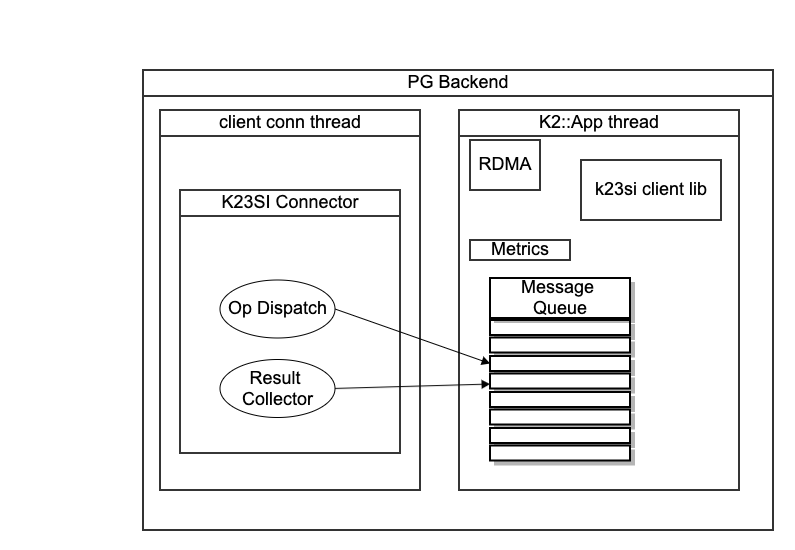

This document describes the plan to integrate the k2 software with the PG-YB codebase.

# Introduction
At a high level, the current PG-YB integration was done by the YDB team by introducing the PGGATE component. We're taking the same approach and have refactored the necessary interface in src/k2/connector/yb/pggate

Our goals with this integration are:
- Reuse K2 DTO interface. When we communicate with K2, we need to use the K2 DTO-based interface which specifies the objects and APIs of the interface. For example, a record is represented as a SKVRecord,
- Minimize and/or eliminate additional data copy in the K23SI interaction
- Take advantage of low-latency communication capability of the K2 platform in order to communicate with the SKV store

# Existing system
We're building this integration into the Postgres-yugabyte implementation. In the existing system, a Master PG process(C) is started and prepared to receive incoming client connections(sessions).

``` c
/* chogori-sql/src/k2/postgres/src/backend/main/main_cpp_wrapper.cc */
extern "C" {
int PostgresServerProcessMain(int argc, char** argv);
}

int main(int argc, char** argv) {
	return PostgresServerProcessMain(argc, argv);
}
```

This process can assume one of a few roles based on command-line arguments. For our purposes, the important roles are `postmaster` and `backend`.

## postmaster
It creates the server socket for PG, and is ready to accept client connections. The accept starts in a select() loop, followed by accept

```c
/* chogori-sql/src/k2/postgres/src/backend/postmaster/postmaster.c#1642 */
static int
ServerLoop(void) {
    ...
    selres = select(nSockets, &rmask, NULL, NULL, &timeout);
    ...
}

/* chogori-sql/src/k2/postgres/src/backend/libpq/pqcomm.c#754 */
int
StreamConnection(pgsocket server_fd, Port *port)
{
    ...
    if ((port->sock = accept(server_fd,
                            (struct sockaddr *) &port->raddr.addr,
                            &port->raddr.salen)) == PGINVALID_SOCKET)
    {}
    ...
}
```

The connection is then used in BackendStartup() where postmaster makes the connection non-blocking and forks in order to process the incoming connection
```c
static int
BackendStartup(Port *port)
{
    ...
    pid = fork_process();
	if (pid == 0)				/* child */
	{}
    ...
}
```

for "efficiency" postmaster just forks() and assumes the backend role in-place. On windows, it also execs()

## backend

The backend process' job is to handle a single client connection. In the PG-YB world, this is done by doing blocking reads from the client connection until a query is assembled. Note that although the client connection is modified to be nonblocking (as part of `backendInitialize`), the connection is polled until the required data is fully read.

Results are written back to client in a similar, blocking manner.

The yb pggate hooks in-here in order to communicate with the Yugabyte doc store. It does so by creating its own event loop, which runs in the same thread using libev. The way this works is that

The YB event look is coded as a Reactor in `src/yb/rpc/reactor.h` and it encapsulates a libev(cpp version) event loop. The query is processed via calls to multiple ybdoc servers, and then the result is sent out via the PG Backend blocking client connection

# Integration proposal
To integrate with the above, we propose to start a separate thread in which we can initialize a `k2::App()` which essentially will run a seastar event loop as with all of our other k2::Apps. The app will be responsible for running the k23si client library and will use a queue to communicate with a thin wrapper on the PG side.



